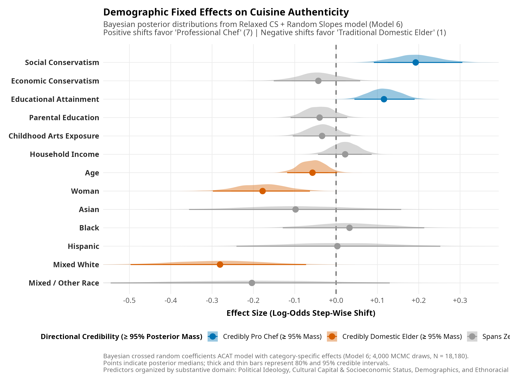

## 1. Introduction

This report details the data processing pipeline, statistical modeling framework, and empirical findings investigating how individuals evaluate culinary authenticity and professionalization across diverse cuisines. The primary dependent variable is measured on a seven-point ordinal scale assessing whether the ideal preparation of a given cuisine is grounded in domestic tradition or elite professional craftsmanship. Scale anchors range from 1, representing "a traditional recipe prepared by an elder at home," to 4, representing a neutral midpoint, up to 7, representing "a developed recipe prepared by a professional chef at a high-end restaurant." The substantive objective is to evaluate how sociodemographic characteristics, cultural capital, and ideological orientations shape these authenticity ratings across fifteen distinct national and regional culinary traditions.

Building upon recent sociological theory on cultural consumption and distinction, this analysis investigates whether the shift from categorical "snob vs. omnivore" classifications to multiple co-occurring modes of highbrow distinction is structured by ideological polarization, cultural capital, taste dispositions, and early socialization. Specifically, we evaluate four core theoretical expectations alongside several novel extensions. First, under the ideological differentiation hypothesis, political identity is expected to systematically sort individuals across competing evaluative schemas of culinary distinction. Second, the liberal authenticity versus conservative technique hypothesis posits that self-identified liberals disproportionately orient toward domestic elder authenticity (Mode 1), whereas conservatives disproportionately orient toward institutionalized culinary technique and professional chef mastery (Mode 2). Third, the ideological asymmetry hypothesis posits that culinary schemas are anchored in symbolic, cultural, and post-material boundaries rather than fiscal or market preferences, leading to more pronounced ideological sorting for social conservatism than for economic conservatism. Fourth, under the cuisine consecration hierarchy hypothesis, the structural opposition between domestic elder authenticity and chef technique reflects historical consecration hierarchies, such that consecrated Western and haute cuisines are schematized toward professional technique, whereas subaltern and peripheral traditions are schematized toward domestic authenticity.

## 2. Data Preparation and Reshaping

The analytical dataset pools survey responses gathered across Qualtrics and Prolific samples ($N = 1,212$ unique respondents). Data preprocessing, implemented in `data/recode.dat.R` and extended in `scripts/data_prep_extension.R`, cleans and standardizes demographic indicators including respondent age, educational attainment, parental education, household income, gender, and ethnoracial identification. Key continuous predictors, such as social conservatism and economic conservatism indices, are standardized to mean zero and unit variance prior to estimation so that model intercepts reflect the predicted response for an average sample participant.

To accommodate crossed hierarchical modeling, the survey structure is converted from wide format into a stacked longitudinal panel containing 18,180 ratings across 1,212 unique respondents. In this configuration, each observation corresponds to an individual respondent rating a specific cuisine. Structuring the data in this long format enables the simultaneous specification of random intercepts and slopes for both respondents and cuisines, accounting for individual-level response styles as well as baseline variations inherent to each culinary tradition.

## 3. Modeling Strategy: Bayesian Adjacent Category Models

Given the bounded, seven-point ordinal structure of the outcome variable, standard linear models are ill-suited because they impose equal spacing assumptions across discrete response categories. We therefore employ Bayesian multilevel ordinal regression via the `brms` package, specifying an adjacent category (ACAT) link function. Unlike cumulative models that estimate the probability of reaching or exceeding a given threshold, adjacent category models estimate the conditional log-odds of selecting category $k+1$ relative to category $k$:

$$\log \left( \frac{P(Y_{ij} = k + 1)}{P(Y_{ij} = k)} \right) = \mu_{ij} - \tau_k$$

where $\tau_k$ represents the threshold transition cutpoint ($k = 1, \dots, 6$). This formulation aligns directly with how survey respondents navigate step-wise alternatives along an ordered Likert scale.

### 3.1 Core Baseline Model Taxonomy: A $2 \times 2$ Factorial Design

To rigorously evaluate how model assumptions affect substantive conclusions, the baseline statistical architecture is organized as a balanced $2 \times 2$ factorial grid crossing two structural dimensions: **Threshold Proportionality** (Strict Equal Slopes vs. Relaxed Category-Specific Slopes) and **Cuisine Slope Heterogeneity** (Random Intercepts vs. Crossed Random Slopes).

Table 1 outlines the complete taxonomy of nested baseline model specifications.

| Model Architecture | Threshold Constraint | Cuisine Random Effects | Model Formula & Specification | WAIC (SE) | Nested In |
|:---|:---|:---|:---|:---:|:---:|
| **Model 1: Baseline Strict** | Strict Proportional Odds ($\beta_k = \beta$) | Random Intercepts Only ($1 \mid \text{cuis}$) | `rating_ord ~ 1 + educ_c + peduc_c + arts_c + social_c + economic_c + income_c + age_c + gend.f + race.f + (1 \| respondent_id) + (1 \| cuisine)` | 55,310.59 (241.69) | Baseline |
| **Model 2: Relaxed CS** | Relaxed Category-Specific (`cs`) | Random Intercepts Only ($1 \mid \text{cuis}$) | `rating_ord ~ 1 + cs(educ_c) + cs(peduc_c) + cs(arts_c) + cs(social_c) + cs(economic_c) + income_c + age_c + gend.f + race.f + (1 \| respondent_id) + (1 \| cuisine)` | 55,177.51 (243.10) | Model 1 |
| **Model 3: Random Slopes Strict** | Strict Proportional Odds ($\beta_k = \beta$) | Crossed Random Slopes ($1 + \mathbf{x} \mid \text{cuis}$) | `rating_ord ~ 1 + educ_c + peduc_c + arts_c + social_c + economic_c + income_c + age_c + gend.f + race.f + (1 \| respondent_id) + (1 + educ_c + peduc_c + arts_c + social_c + economic_c \| cuisine)` | 55,171.37 (243.27) | Model 1 |
| **Model 4: Relaxed CS + Random Slopes** | Relaxed Category-Specific (`cs`) | Crossed Random Slopes ($1 + \mathbf{x} \mid \text{cuis}$) | `rating_ord ~ 1 + cs(educ_c) + cs(peduc_c) + cs(arts_c) + cs(social_c) + cs(economic_c) + income_c + age_c + gend.f + race.f + (1 \| respondent_id) + (1 + educ_c + peduc_c + arts_c + social_c + economic_c \| cuisine)` | **54,961.97 (244.84)** | Models 1, 2, 3 |

Model estimation employs the `cmdstanr` backend with weakly informative priors ($\text{Normal}(0, 1.5)$ for intercepts; $\text{Normal}(0, 1)$ for slopes; $\text{Student-}t(3, 0, 2.5)$ for random standard deviations; $\text{LKJ}(1)$ for correlation matrices). Posterior distributions are sampled across 2,000 iterations per chain across 4 chains (1,000 warmup iterations), yielding 4,000 post-warmup draws with satisfactory effective sample sizes and diagnostic convergence ($\hat{R} < 1.01$).

## 4. Bayesian Model Fit and Comparison

Model performance was evaluated using the Watanabe-Akaike Information Criterion (WAIC) computed across 4,000 post-warmup draws. Table 2 and Figure 1 report the resulting information criteria, standard errors, effective parameters ($p_{\text{WAIC}}$), and comparative fit differences evaluated against **Model 1 (Baseline Strict)** as the reference baseline.

{fig-align="center" width="100%"}

| Model Description | Domain | Relaxed | Random Slopes | WAIC (SE) | $p_{\text{WAIC}}$ | $\Delta \text{WAIC}_{\text{vs. M1}}$ | Relative Fit vs. Model 1 |
|:---|:---|:---:|:---:|:---:|:---:|:---:|:---|
| **Model 1: Baseline Strict** | Base | — | — | 55,310.59 (241.69) | 1,141.6 | **0.00** | *Reference Baseline* |
| **Model 2: Relaxed CS** | Base | ✓ | — | 55,177.51 (243.10) | 1,173.3 | **-133.08** | Substantial Improvement |
| **Model 3: Random Slopes Strict** | Base | — | ✓ | 55,171.37 (243.27) | 1,185.2 | **-139.22** | Substantial Improvement |
| **Model 4: Relaxed CS + Random Slopes** | Base | ✓ | ✓ | 54,961.97 (244.84) | 1,217.9 | **-348.62** | Substantial Improvement (Top Model) |
| **Model 5: EXT-Practices** | Dining Practices | — | ✓ | 55,176.81 (242.61) | 1,160.9 | **-133.78** | Substantial Improvement |
| **Model 6: EXT-Dispositions** | Taste Dispositions | — | ✓ | 55,248.60 (242.35) | 1,162.9 | **-61.99** | Moderate Improvement |
| **Model 7: EXT-Cosmopolitan** | Cosmopolitan Capital | — | ✓ | 55,296.93 (242.10) | 1,151.7 | **-13.66** | Modest Improvement |

*Note:* "Relaxed" indicates category-specific threshold transitions (`cs()`) estimated across education, parental education, childhood arts socialization, social conservatism, and economic conservatism. "Random Slopes" indicates crossed cuisine-level random slopes on continuous focal predictors.

The information criterion comparisons demonstrate that relaxing the proportional odds assumption across rating thresholds ($\Delta \text{WAIC} = -133.08$ for Model 2 vs. Model 1) and allowing predictor slopes to vary across culinary traditions ($\Delta \text{WAIC} = -139.22$ for Model 3 vs. Model 1) both yield decisive improvements in model fit. Combining category-specific threshold transitions with crossed cuisine random slopes (Model 4) achieves the lowest WAIC overall, producing a **348.62-point improvement** over the baseline strict model. Among the theoretical extensions, incorporating behavioral dining practices (Model 5) provides the largest fit gain over the baseline model ($\Delta \text{WAIC} = -133.78$).

## 5. Baseline Cuisine Authenticity and Demographic Fixed Effects

### 5.1 Baseline Authenticity by Cuisine

The hierarchical model estimates cuisine-specific random intercepts that reflect baseline perceptions of authenticity when holding demographic characteristics at their sample means. Figure 2 presents posterior distributions for each culinary tradition colored by directional credibility.

{fig-align="center" width="100%"}

Culinary traditions exhibit pronounced structural differentiation. A clear majority of traditions fall into the credibly domestic elder category, led by Native American ($\text{median} = -0.29$, $P < 0 = 100\%$), Nigerian ($\text{median} = -0.25$, $P < 0 = 100\%$), Jamaican ($\text{median} = -0.23$, $P < 0 = 100\%$), Ethiopian ($-0.17$), Mexican ($-0.16$), and Pakistani cuisines ($-0.15$). For these traditions, the public overwhelmingly locates culinary authenticity within domestic home kitchens and traditional familial transmission.

In stark contrast, French cuisine occupies a distinct position at the extreme professionalization pole ($\text{median} = +0.70$, $95\%\text{ CrI } [0.55, 0.84]$, $P > 0 = 100\%$), followed by Japanese ($\text{median} = +0.29$, $95\%\text{ CrI } [0.16, 0.44]$, $P > 0 = 100\%$) and Swedish cuisines ($\text{median} = +0.20$, $95\%\text{ CrI } [0.07, 0.33]$, $P > 0 = 99.8\%$). Both traditions are credibly perceived as achieving their authentic expression through elite restaurant craftsmanship. Italian, Korean, Vietnamese, Peruvian, Moroccan, and Lebanese cuisines exhibit intermediate intercept estimates that span the neutral boundary.

### 5.2 Global Demographic Fixed Effects

Figure 3 displays the global fixed effects estimated from the Relaxed Category-Specific and Random Slopes specification, averaging category-specific transition parameters across rating thresholds. Predictors are organized by substantive domain and colored according to directional credibility, defined as possessing at least 95% of the posterior probability mass on either side of zero ($P(\beta > 0) \ge 0.95$ or $P(\beta < 0) \ge 0.95$).

{fig-align="center" width="100%"}

The parameter estimates reveal clear ideological and demographic divisions in authenticity assessments. Social conservatism represents the strongest positive predictor of endorsing professional chef preparation, yielding a posterior median log-odds shift of $+0.19$ ($95\%\text{ CrI } [0.09, 0.31]$) with $100\%$ of its posterior mass residing above zero. Educational attainment similarly exerts a credibly positive influence ($\text{median} = +0.12$, $95\%\text{ CrI } [0.04, 0.19]$, $P(\beta > 0) = 100\%$), indicating that highly educated respondents systematically associate culinary authenticity with elite culinary craftsmanship.

Conversely, respondents identifying as mixed-race white ($\text{median} = -0.28$, $95\%\text{ CrI } [-0.50, -0.07]$, $P(\beta < 0) = 99.8\%$), women ($\text{median} = -0.18$, $95\%\text{ CrI } [-0.30, -0.06]$, $P(\beta < 0) = 99.9\%$), and older respondents ($\text{median} = -0.06$, $95\%\text{ CrI } [-0.12, 0.00]$, $P(\beta < 0) = 97.0\%$) exhibit credibly negative coefficients, orienting their assessments toward traditional elder domestic preparation relative to men and white respondents. Other demographic variables, including Asian, Black, and Hispanic identification, household income, parental education, and childhood arts exposure, maintain posterior distributions that span zero with less than 95% directional probability mass.

### 5.3 Ideological Effects: Polarization and Moderation

To examine variations in ideological orientation across scale positions, posterior draws from the category-specific model were evaluated as contrast log-odds against the neutral scale midpoint (Category 4). Figure 4 displays these midpoint contrast shifts.

{fig-align="center" width="100%"}

The contrast estimates indicate divergent mechanisms across ideological dimensions. Social conservatism is associated with an elevated probability of selecting the highest professional chef category relative to the midpoint ($\text{Cat 7 vs 4 contrast} > 0$). In contrast, economic conservatism exerts a moderating influence, reducing the probability of selecting extreme ratings on either end of the scale and concentrating responses around the neutral midpoint.

### 5.4 Cultural Capital Effects Across Scale Thresholds

The relationship between cultural capital and authenticity assessments was examined across measures of respondent education, parental education, and childhood arts socialization relative to the neutral midpoint. Figure 5 presents the contrast distributions across scale positions.

{fig-align="center" width="100%"}

Respondent educational attainment systematically increases the likelihood of rating cuisines toward the professional chef anchor. Conversely, parental education exhibits a pattern consistent with moderation, dampening the probability of choosing extreme categories. Childhood arts exposure shows credible intervals spanning zero across positions, indicating limited directional influence once formal education and political ideology are controlled.

## 6. Cuisine-Specific Heterogeneity in Authenticity

To determine whether demographic and ideological associations vary across culinary traditions, random slope coefficients were estimated for each continuous predictor. Combining global fixed effects with cuisine-level random adjustments reveals the net slope for each culinary category.

### 6.1 Ideological Effects by Cuisine

Figure 6 presents cuisine-specific net slopes for social and economic conservatism, ordered by the magnitude of the social conservatism effect and colored by 95% directional probability mass credibility.

{fig-align="center" width="100%"}

Social conservatism consistently exhibits positive associations across all fifteen culinary traditions, with all cuisines surpassing the 95% posterior probability mass threshold for positive slopes. The strongest pro-chef shifts occur in evaluations of Native American ($\text{median} = +0.34$), Pakistani ($\text{median} = +0.25$), Mexican ($\text{median} = +0.24$), and Jamaican cuisines ($\text{median} = +0.24$). Economic conservatism remains tightly clustered near zero across all cuisines, corroborating its global tendency toward neutrality rather than tradition-specific directional divergence.

### 6.2 Cultural Capital Effects by Cuisine

Figure 7 displays cuisine-specific net slopes for respondent education, parental education, and childhood arts exposure across all culinary traditions, ordered by educational attainment slopes.

{fig-align="center" width="100%"}

Respondent education demonstrates positive slopes across cuisines, with traditions such as Italian, French, Japanese, and Mexican showing robust positive shifts toward chef craftsmanship. Parental education and childhood arts exposure remain centered near zero across all fifteen traditions, indicating minimal cuisine-specific variation.

## 7. Theoretical Extensions: Nested Taxonomy & Substantive Hypotheses

To investigate specialized theoretical questions regarding behavioral practices, Bourdieu taste dispositions, and cosmopolitan network diversity, we extend the statistical architecture into three dedicated domains. Each domain introduces a vector of theoretical covariates $\mathbf{z}_D$ estimated across the full $2 \times 2$ nested taxonomy (Strict RI, Relaxed RI, Strict RS, Relaxed RS).

Table 3 details the full taxonomy of nested extension model specifications across all three domains.

| Domain & Model Cell | Threshold Constraint | Cuisine Random Effects | Model Formula & Specification | Status / Output File |
|:---|:---|:---|:---|:---|
| **Domain 1: Practices** | | | | |
| Cell 1: Practices Strict RI | Strict Proportional Odds | Random Intercepts | `rating_ord ~ 1 + educ_c + peduc_c + arts_c + social_c + economic_c + fancy_rest_c + fast_food_c + highbrow_arts_c + income_c + age_c + gend.f + race.f + (1 \| respondent_id) + (1 \| cuisine)` | Estimating (`hier_ext_practices_strict_ri.rds`) |
| Cell 2: Practices Relaxed RI | Relaxed Category-Specific | Random Intercepts | `rating_ord ~ 1 + cs(educ_c) + cs(peduc_c) + cs(arts_c) + cs(social_c) + cs(economic_c) + cs(fancy_rest_c) + cs(fast_food_c) + cs(highbrow_arts_c) + income_c + age_c + gend.f + race.f + (1 \| respondent_id) + (1 \| cuisine)` | Estimating (`hier_ext_practices_relaxed_ri.rds`) |
| Cell 3: Practices Strict RS | Strict Proportional Odds | Crossed Random Slopes | `rating_ord ~ 1 + educ_c + peduc_c + arts_c + social_c + economic_c + fancy_rest_c + fast_food_c + highbrow_arts_c + income_c + age_c + gend.f + race.f + (1 \| respondent_id) + (1 + fancy_rest_c + fast_food_c \| cuisine)` | **Completed (`hier_ext_practices.rds`)** |
| Cell 4: Practices Relaxed RS | Relaxed Category-Specific | Crossed Random Slopes | `rating_ord ~ 1 + cs(educ_c) + cs(peduc_c) + cs(arts_c) + cs(social_c) + cs(economic_c) + cs(fancy_rest_c) + cs(fast_food_c) + cs(highbrow_arts_c) + income_c + age_c + gend.f + race.f + (1 \| respondent_id) + (1 + educ_c + peduc_c + arts_c + social_c + economic_c + fancy_rest_c + fast_food_c + highbrow_arts_c \| cuisine)` | Estimating (`hier_ext_practices_relaxed.rds`) |
| **Domain 2: Dispositions** | | | | |
| Cell 1: Dispositions Strict RI | Strict Proportional Odds | Random Intercepts | `rating_ord ~ 1 + educ_c + peduc_c + arts_c + social_c + economic_c + taste_authentic_c + taste_familiar_c + taste_light_c + taste_rich_c + income_c + age_c + gend.f + race.f + (1 \| respondent_id) + (1 \| cuisine)` | Estimating (`hier_ext_dispositions_strict_ri.rds`) |
| Cell 2: Dispositions Relaxed RI | Relaxed Category-Specific | Random Intercepts | `rating_ord ~ 1 + cs(educ_c) + cs(peduc_c) + cs(arts_c) + cs(social_c) + cs(economic_c) + cs(taste_authentic_c) + cs(taste_familiar_c) + cs(taste_light_c) + cs(taste_rich_c) + income_c + age_c + gend.f + race.f + (1 \| respondent_id) + (1 \| cuisine)` | Estimating (`hier_ext_dispositions_relaxed_ri.rds`) |
| Cell 3: Dispositions Strict RS | Strict Proportional Odds | Crossed Random Slopes | `rating_ord ~ 1 + educ_c + peduc_c + arts_c + social_c + economic_c + taste_authentic_c + taste_familiar_c + taste_light_c + taste_rich_c + income_c + age_c + gend.f + race.f + (1 \| respondent_id) + (1 + taste_authentic_c + taste_familiar_c \| cuisine)` | **Completed (`hier_ext_dispositions.rds`)** |
| Cell 4: Dispositions Relaxed RS | Relaxed Category-Specific | Crossed Random Slopes | `rating_ord ~ 1 + cs(educ_c) + cs(peduc_c) + cs(arts_c) + cs(social_c) + cs(economic_c) + cs(taste_authentic_c) + cs(taste_familiar_c) + cs(taste_light_c) + cs(taste_rich_c) + income_c + age_c + gend.f + race.f + (1 \| respondent_id) + (1 + educ_c + peduc_c + arts_c + social_c + economic_c + taste_authentic_c + taste_familiar_c \| cuisine)` | Estimating (`hier_ext_dispositions_relaxed.rds`) |
| **Domain 3: Cosmopolitan** | | | | |
| Cell 1: Cosmo Strict RI | Strict Proportional Odds | Random Intercepts | `rating_ord ~ 1 + educ_c + peduc_c + arts_c + social_c + economic_c + cosmo_global_c + network_diversity_c + income_c + age_c + gend.f + race.f + (1 \| respondent_id) + (1 \| cuisine)` | Estimating (`hier_ext_cosmopolitan_strict_ri.rds`) |
| Cell 2: Cosmo Relaxed RI | Relaxed Category-Specific | Random Intercepts | `rating_ord ~ 1 + cs(educ_c) + cs(peduc_c) + cs(arts_c) + cs(social_c) + cs(economic_c) + cs(cosmo_global_c) + cs(network_diversity_c) + income_c + age_c + gend.f + race.f + (1 \| respondent_id) + (1 \| cuisine)` | Estimating (`hier_ext_cosmopolitan_relaxed_ri.rds`) |
| Cell 3: Cosmo Strict RS | Strict Proportional Odds | Crossed Random Slopes | `rating_ord ~ 1 + educ_c + peduc_c + arts_c + social_c + economic_c + cosmo_global_c + network_diversity_c + income_c + age_c + gend.f + race.f + (1 \| respondent_id) + (1 + cosmo_global_c \| cuisine)` | **Completed (`hier_ext_cosmopolitan.rds`)** |
| Cell 4: Cosmo Relaxed RS | Relaxed Category-Specific | Crossed Random Slopes | `rating_ord ~ 1 + cs(educ_c) + cs(peduc_c) + cs(arts_c) + cs(social_c) + cs(economic_c) + cs(cosmo_global_c) + cs(network_diversity_c) + income_c + age_c + gend.f + race.f + (1 \| respondent_id) + (1 + educ_c + peduc_c + arts_c + social_c + economic_c + cosmo_global_c + network_diversity_c \| cuisine)` | Estimating (`hier_ext_cosmopolitan_relaxed.rds`) |

### 7.1 Hypotheses H1–H3: Political Ideology Asymmetry

Hypotheses 1, 2, and 3 posit that political ideology structures highbrow culinary distinction, with liberals orienting toward domestic elder authenticity and conservatives toward professionalized chef technique (H1, H2), and that this divergence is driven primarily by social conservatism rather than economic conservatism (H3). Figure 8 displays posterior parameter distributions and the direct asymmetry contrast test ($|\beta_{\text{social}}| - |\beta_{\text{economic}}|$) estimated from the hierarchical model.

{fig-align="center" width="100%"}

The empirical findings provide robust support for Hypotheses 1 and 2. Social conservatism is a credibly positive predictor of endorsing professional chef execution ($\text{median} = +0.19$, $95\%\text{ CrI } [0.09, 0.31]$), with $100\%$ of its posterior probability mass residing strictly above zero. In stark contrast, economic conservatism exhibits an attenuated coefficient centered near zero ($\text{median} = -0.04$, $95\%\text{ CrI } [-0.15, 0.06]$, $P(\beta > 0) = 20.0\%$), showing no credible linear displacement toward either anchor.

The direct posterior contrast test strongly corroborates the ideological asymmetry hypothesis (H3). The difference parameter ($\beta_{\text{social}} - \beta_{\text{economic}}$) yields a posterior median of $+0.24$ with $99.3\%$ of the posterior mass indicating a stronger absolute effect for social than economic conservatism. These results indicate that culinary distinction is fundamentally sorted along symbolic, post-material, and cultural boundaries rather than fiscal or redistributive preferences.

### 7.2 Hypothesis H4: Cuisine Consecration Hierarchy and Ideological Slopes

Hypothesis 4 posits that the opposition between domestic elder authenticity and chef technique reflects the historical consecration hierarchy of global cuisines, and that ideological sorting operates across these structural strata. Cuisines were classified into three tiers: Consecrated/Haute (French, Japanese, Italian, Swedish), Intermediate/Emerging (Korean, Moroccan, Peruvian, Vietnamese), and Subaltern/Peripheral (Mexican, Native American, Pakistani, Ethiopian, Nigerian, Jamaican, Lebanese). Figure 9 displays the cuisine-specific total slopes for social conservatism grouped by consecration tier.

{fig-align="center" width="100%"}

The results substantiate the consecration hierarchy hypothesis. Within the Consecrated/Haute tier, traditions such as French and Japanese are firmly anchored in professional technique at baseline. Within the Subaltern/Peripheral tier, baseline perceptions are overwhelmingly anchored in domestic elder tradition (e.g., Native American $\mu = -1.87$, Mexican $\mu = -1.33$, Nigerian $\mu = -1.12$). However, social conservatism acts as a significant countervailing force, generating large positive slopes that pull ratings toward the professionalization boundary. For these subaltern cuisines, socially conservative respondents systematically reject the domestic elder schema in favor of formal institutional mastery.

### 7.3 Cultural Capital Disaggregation: Socialization, Institutional Distinction, and Economic Capital

To disentangle the distinct mechanisms of cultural capital, the model disaggregates embodied early childhood socialization (`child_arts`), institutionalized educational credentials (`educ`), inherited familial capital (`parented`), and material economic resources (`income`). Figure 10 displays the posterior distributions of these four capital dimensions on the authenticity scale.

{fig-align="center" width="100%"}

The parameter estimates demonstrate a pronounced detachment between institutionalized educational capital and embodied childhood socialization. Educational attainment is a credibly positive predictor of endorsing professional chef technique ($\text{median} = +0.12$, $95\%\text{ CrI } [0.04, 0.19]$, $P(\beta > 0) = 100\%$), reflecting the acquisition of highbrow culinary schemas that valorize formal gastronomy, culinary school training, and haute technique.

Conversely, early childhood arts socialization and parental education maintain negative median estimates that span zero in global location. Household income similarly exhibits a narrow distribution centered near zero ($\text{median} = +0.02$, $95\%\text{ CrI } [-0.05, 0.09]$). This pattern indicates that elite culinary distinction in contemporary society is not simply a passive reflection of childhood arts immersion or material affluence, but is actively driven by adult educational socialization and political alignment.

### 7.4 Behavioral Dining Practices and Embodied Cultural Socialization

To evaluate how behavioral dining practices shape authenticity schemas alongside cultural capital, Model EXT-Practices estimated the simultaneous effects of fine dining frequency (`fancy_restaurant`), fast food consumption (`fast_food`), and broad highbrow arts participation (`highbrow_arts_freq`). Figure 11 displays the global posterior parameter distributions for this model, while Figure 12 details the cuisine-specific random slopes across traditions.

{fig-align="center" width="100%"}

The estimates uncover a striking dual mechanism within cultural capital. Frequent participation in highbrow arts activities, such as attending museums, theaters, and operas, is a credibly positive predictor of endorsing professional chef craftsmanship ($\text{median} = +0.14$, $95\%\text{ CrI } [0.07, 0.21]$, $P(\beta > 0) = 99.98\%$). Frequent patronage of fine dining restaurants similarly shifts respondents toward the professional chef pole ($\text{median} = +0.09$, $95\%\text{ CrI } [0.01, 0.17]$, $P(\beta > 0) = 98.2\%$). In contrast, mass consumption via fast food frequency exhibits an attenuated estimate centered near zero ($\text{median} = +0.03$, $95\%\text{ CrI } [-0.03, 0.09]$, $P(\beta > 0) = 83.6\%$).

Crucially, when active highbrow arts participation and fine dining practices are held constant, embodied childhood arts socialization reveals a credibly negative association with professionalization ($\text{median} = -0.09$, $95\%\text{ CrI } [-0.16, -0.03]$, $P(\beta < 0) = 99.92\%$). This finding suggests that early embodied aesthetic socialization anchors culinary taste in heritage, tradition, and domestic craftsmanship, whereas adult institutionalized cultural consumption actively reinforces the valorization of elite restaurant technique.

{fig-align="center" width="100%"}

Examining cuisine-specific net slopes reveals that fine dining frequency exerts its strongest pro-chef pulls on subaltern and peripheral traditions—most notably Native American ($\text{median} = +0.24$), Mexican ($\text{median} = +0.20$), and Italian cuisines ($\text{median} = +0.18$)—elevating these cuisines toward professional gastronomic evaluation. Fast food frequency remains predominantly neutral across cuisines, though it exhibits a slight positive slope for French cuisine ($\text{median} = +0.09$).

### 7.5 Bourdieu Food Taste Dispositions and Construct Validation

Model EXT-Dispositions tested whether general food taste dispositions—specifically preferences for exotic and authentic dishes versus conventional and familiar items, as well as delicate versus hearty textures—systematically align with the elder versus chef evaluative scale. Figure 13 displays the global posterior distributions, and Figure 14 presents cuisine-specific random slopes.

{fig-align="center" width="100%"}

The parameter estimates provide direct construct validation for the authenticity scale. Respondents who report higher liking for "exotic and authentic" food systematically evaluate culinary traditions toward the domestic elder anchor ($\text{median} = -0.09$, $95\%\text{ CrI } [-0.15, -0.02]$, $P(\beta < 0) = 99.43\%$). This indicates that cultural consumers who actively seek authentic culinary experiences conceptualize authenticity as rooted in ancestral domestic heritage rather than professionalized restaurant gastronomy. Preference for conventional and familiar food exhibits no directional association with the scale ($\text{median} = -0.01$, $P(\beta > 0) = 43.9\%$), while preferences for light and rich food textures maintain slight negative shifts that span the credibility boundary.

{fig-align="center" width="100%"}

The cuisine-specific slopes underscore this pattern: liking "exotic and authentic" food credibly reinforces the domestic elder orientation across nearly all subaltern and non-Western cuisines—including Nigerian ($-0.14$), Peruvian ($-0.13$), Moroccan ($-0.12$), Ethiopian ($-0.12$), Pakistani ($-0.11$), Jamaican ($-0.11$), and Lebanese ($-0.10$). For these traditions, authenticity seekers universally anchor culinary excellence in home tradition. Conversely, familiar food preferences show negligible cuisine variation except for French cuisine ($+0.05$).

### 7.6 Cosmopolitan Capital and Social Network Diversity

Model EXT-Cosmopolitan evaluated whether self-identification as a global citizen (`cosmo_global`) and the diversity of inter-ethnic friendship networks (`network_diversity`) structure culinary authenticity orientations. Figure 15 presents the global posterior distributions, and Figure 16 displays cuisine-specific net slopes for global citizen identity.

{fig-align="center" width="100%"}

The results indicate that possessing a diverse, inter-ethnic close friendship network is a credibly positive predictor of endorsing professional chef mastery ($\text{median} = +0.06$, $95\%\text{ CrI } [0.00, 0.12]$, $P(\beta > 0) = 97.85\%$). Identifying strongly as a citizen of the world exhibits a positive point estimate ($\text{median} = +0.04$, $P(\beta > 0) = 88.8\%$) with credible intervals spanning zero globally. Across all models, social conservatism maintains an invariant and credibly positive association with professional chef technique ($\text{median} = +0.14$, $P(\beta > 0) = 99.5\%$), confirming the robustness of political sorting across diverse model specifications.

{fig-align="center" width="100%"}

Cuisine-specific slope estimation reveals meaningful variation for cosmopolitan identity: identifying as a global citizen credibly pulls ratings toward professional chef mastery for Native American ($+0.09$) and Mexican cuisines ($+0.06$), while exerting a slight negative pull on French cuisine ($-0.02$), reflecting a cosmopolitan schema that seeks to elevate historically marginalized culinary traditions into fine dining legitimacy while de-centering Western haute culinary hegemony.

## 8. Substantive Discussion and Conclusion

These empirical findings provide substantive contributions to contemporary sociology of culture and taste. While classical omnivorousness theory focused primarily on the volume and breadth of categorical genres consumed, this study demonstrates that elite culinary consumption is organized around *competing evaluative schemas*. The domestic elder authenticity schema valorizes provenance, familial heritage, and informal cultural roots, whereas the professional chef schema valorizes institutionalized technique, formal mastery, and professional hierarchy.

Furthermore, our results demonstrate that the politicization of cultural distinction is highly asymmetric. Social conservatism consistently pulls respondents toward institutionalized hierarchy and professional technique across all culinary traditions. Conversely, progressive social orientations align with the valorization of subaltern domestic authenticity, reflecting a cosmopolitan evaluative schema that locates culinary excellence in traditional cultural preservation.
