## 1. Introduction

This report details the data processing pipeline, statistical modeling framework, and empirical findings investigating how individuals evaluate culinary authenticity and professionalization across diverse cuisines. The primary dependent variable is measured on a seven-point ordinal scale assessing whether the ideal preparation of a given cuisine is grounded in domestic tradition or elite professional craftsmanship. Scale anchors range from 1, representing "a traditional recipe prepared by an elder at home," to 4, representing a neutral midpoint, up to 7, representing "a developed recipe prepared by a professional chef at a high-end restaurant." The substantive objective is to evaluate how sociodemographic characteristics, cultural capital, and ideological orientations shape these authenticity ratings across fifteen distinct national and regional culinary traditions.

Building upon recent sociological theory on cultural consumption and distinction, this analysis investigates whether the shift from categorical "snob vs. omnivore" classifications to multiple co-occurring modes of highbrow distinction is structured by ideological polarization, cultural capital, taste dispositions, and early socialization. Specifically, we evaluate four core theoretical expectations alongside several novel extensions. First, under the ideological differentiation hypothesis, political identity is expected to systematically sort individuals across competing evaluative schemas of culinary distinction. Second, the liberal authenticity versus conservative technique hypothesis posits that self-identified liberals disproportionately orient toward domestic elder authenticity (Mode 1), whereas conservatives disproportionately orient toward institutionalized culinary technique and professional chef mastery (Mode 2). Third, the ideological asymmetry hypothesis posits that culinary schemas are anchored in symbolic, cultural, and post-material boundaries rather than fiscal or market preferences, leading to more pronounced ideological sorting for social conservatism than for economic conservatism. Fourth, under the cuisine consecration hierarchy hypothesis, the structural opposition between domestic elder authenticity and chef technique reflects historical consecration hierarchies, such that consecrated Western and haute cuisines are schematized toward professional technique, whereas subaltern and peripheral traditions are schematized toward domestic authenticity.

## 2. Data Preparation and Reshaping

## 2. Data Preparation and Reshaping

The analytical dataset pools survey responses gathered across Qualtrics and Prolific samples ($N = 1,212$ unique respondents). Data preprocessing, implemented in `data/recode.dat.R` and extended in `scripts/data_prep_extension.R`, cleans and standardizes demographic indicators including respondent age, educational attainment, parental education, household income, gender, and ethnoracial identification. Key continuous predictors are standardized to mean zero and unit variance prior to estimation so that model intercepts reflect the predicted response for an average sample participant.

### 2.1 Survey Operationalization and Variable Measurement

Each substantive predictor in the statistical models is operationalized from specific survey items:

#### Dependent Variable: Cuisine Authenticity and Professionalization Scale
* **Survey Item:** Respondents evaluated fifteen national and regional cuisines (French, Japanese, Swedish, Italian, Korean, Vietnamese, Peruvian, Moroccan, Lebanese, Pakistani, Mexican, Ethiopian, Jamaican, Nigerian, Native American) on a 7-point Likert scale asking whether the ideal preparation is grounded in domestic tradition or elite professional craftsmanship:
  * **1:** *"A traditional recipe prepared by an elder at home"*
  * **4:** *"Equal / One is not better than the other"* (Neutral Midpoint)
  * **7:** *"A developed recipe prepared by a professional chef at a high-end restaurant"*
  * Categories 2–3 and 5–6 represent intermediate gradations toward the domestic and professional poles, respectively.

#### 1. Political Ideology Indicators
* **Social Conservatism (`social_c`):** Measured on a 7-point Likert scale ($1 = \text{"Very liberal"}$, $2 = \text{"Liberal"}$, $3 = \text{"Slightly liberal"}$, $4 = \text{"Centrist"}$, $5 = \text{"Slightly conservative"}$, $6 = \text{"Conservative"}$, $7 = \text{"Very conservative"}$) evaluating political orientation on social and cultural issues. Standardized to mean zero and unit variance.
* **Economic Conservatism (`economic_c`):** Measured on an identical 7-point Likert scale ($1 = \text{"Very liberal"}$ to $7 = \text{"Very conservative"}$) evaluating political orientation on economic, fiscal, and market issues. Standardized to mean zero and unit variance.

#### 2. Cultural Capital & Socialization Indicators
* **Respondent Educational Attainment (`educ_c`):** Measured on a 7-category ordinal scale: $1 = \text{Less than 9th grade}$, $2 = \text{Some high school}$, $3 = \text{High school graduate / GED}$, $4 = \text{Some college / vocational school}$, $5 = \text{Associate degree}$, $6 = \text{Bachelor's degree (BA/BS)}$, $7 = \text{Graduate or professional degree (MA/MS, PhD, MD, JD)}$. Standardized continuous predictor.
* **Parental Educational Attainment (`peduc_c`):** Measured on the identical 7-category ordinal scale evaluating the highest educational credential attained by the respondent's parents. Standardized continuous predictor.
* **Childhood Arts Socialization (`arts_c`):** Measured as the reported frequency of arts exposure and cultural socialization during childhood (museum visits, concerts, theater attendance, reading). Standardized continuous predictor.

#### 3. Behavioral Dining & Cultural Practices (Domain 2)
* **Fine Dining Frequency (`fancy_rest_c`):** Measured on a 7-point ordinal scale asking how often the respondent ate at a "fancy, table-service restaurant" in the past year: $1 = \text{Not in past year}$, $2 = 1\text{--}2\text{ times}$, $3 = 3\text{--}5\text{ times}$, $4 = 6\text{--}11\text{ times}$, $5 = 12\text{--}23\text{ times}$, $6 = 24\text{--}51\text{ times}$, $7 = 52+\text{ times (weekly or more)}$. Standardized.
* **Fast Food Frequency (`fast_food_c`):** Measured on the identical 7-point frequency scale asking how often the respondent ate at fast-food restaurants in the past year. Standardized.
* **Adult Highbrow Arts Attendance (`highbrow_arts_c`):** Continuous composite index constructed as the arithmetic mean frequency across five highbrow cultural activities in the past year, each evaluated on the same 7-point frequency scale ($1 = \text{Never}$ to $7 = 52+\text{ times}$): (1) art museums, (2) art galleries, (3) classical symphony orchestra or opera, (4) live theatrical plays or musicals, and (5) live dance or ballet performances ($\alpha = 0.84$). Standardized.

#### 4. Bourdieu Food Taste Dispositions (Domain 3)
* Evaluated across four distinct sensory and aesthetic food preference dimensions measured on 7-point Likert liking scales ($1 = \text{"Very Much Dislike"}$, $2 = \text{"Dislike"}$, $3 = \text{"Somewhat Dislike"}$, $4 = \text{"Neither Like nor Dislike"}$, $5 = \text{"Somewhat Like"}$, $6 = \text{"Like"}$, $7 = \text{"Very Much Like"}$):
  * **Exotic / Authentic Preference (`taste_authentic_c`):** Liking for "exotic, authentic, and traditional dishes." Standardized.
  * **Familiar / Comfort Preference (`taste_familiar_c`):** Liking for "conventional, familiar, and comfort food dishes." Standardized.
  * **Light / Fresh Texture Preference (`taste_light_c`):** Preference for "light, airy, fresh, and delicate" food preparations. Standardized.
  * **Rich / Hearty Texture Preference (`taste_rich_c`):** Preference for "rich, hearty, filling, and savory" food preparations. Standardized.

#### 5. Cosmopolitan Capital & Social Networks (Domain 4)
* **Friendship Network Diversity (`network_diversity_c`):** Summed index ($0\text{--}5$) measuring the presence of strong close friendship ties across five distinct ethnoracial minority groups: Asian, Black, Hispanic/Latino, Middle Eastern/North African (MENA), and Native American close friends. Standardized.
* **Global Citizen Identity (`cosmo_global_c`):** Evaluated on a 7-point influence scale ($1 = \text{"Not at all influential"}$, $4 = \text{"Moderately influential"}$, $7 = \text{"Extremely influential"}$) rating how much being a "citizen of the world" influences the respondent's personal self-identity. Standardized.

#### 6. Sociodemographic Controls
* **Household Income (`income_c`):** 12-category ordinal scale ($1 = <\$10\text{k}$, $2 = \$10\text{k}\text{--}\$19.9\text{k}$, ..., $11 = \$100\text{k}\text{--}\$149.9\text{k}$, $12 = \ge \$150\text{k}$). Category 13 ("Prefer not to say") is recoded as missing and mean-imputed prior to standardization.
* **Age (`age_c`):** Continuous chronological age in years ($17\text{--}88$). Standardized.
* **Gender Identification (`gend.f`):** Categorical factor: Man (reference baseline), Woman, Nonbinary/Other.
* **Ethnoracial Identification (`race.f`):** Categorical factor: White (reference baseline), Black, Hispanic/Latino, Asian, Native American, Mixed/Other.

To accommodate crossed hierarchical modeling, the survey structure is converted from wide format into a stacked longitudinal panel containing 18,180 ratings across 1,212 unique respondents. In this configuration, each observation corresponds to an individual respondent rating a specific cuisine. Structuring the data in this long format enables the simultaneous specification of random intercepts and slopes for both respondents and cuisines, accounting for individual-level response styles as well as baseline variations inherent to each culinary tradition.

## 3. Modeling Strategy: Bayesian Adjacent Category Models

Given the bounded, seven-point ordinal structure of the outcome variable, standard linear models are ill-suited because they impose equal spacing assumptions across discrete response categories. We therefore employ Bayesian multilevel ordinal regression via the `brms` package, specifying an adjacent category (ACAT) link function. Unlike cumulative models that estimate the probability of reaching or exceeding a given threshold, adjacent category models estimate the conditional log-odds of selecting category $k+1$ relative to category $k$:

$$\log \left( \frac{P(Y_{ij} = k + 1)}{P(Y_{ij} = k)} \right) = \mu_{ij} - \tau_k$$

where $\tau_k$ represents the threshold transition cutpoint ($k = 1, \dots, 6$). This formulation aligns directly with how survey respondents navigate step-wise alternatives along an ordered Likert scale.

### 3.1 Substantive Domains and Factorial Taxonomy

To test the multifaceted mechanisms of cultural distinction, the statistical modeling architecture is organized into **four substantive domains**, with each domain estimated across a balanced $2 \times 2$ factorial grid crossing two structural dimensions: **Threshold Proportionality** (Strict Equal Slopes vs. Relaxed Category-Specific Slopes `cs()`) and **Cuisine Slope Heterogeneity** (Random Intercepts vs. Crossed Random Slopes). This produces a comprehensive $4 \times 2 \times 2 = 16$ model taxonomy:

1. **Domain 1: Core Baseline & Cultural Capital Models (`base`)**
   * *Theoretical Objective:* Evaluates how institutionalized educational credentials, embodied childhood socialization, and political ideology structure culinary authenticity evaluations across traditions.
   * *Variables Included:*
     * *Political Ideology:* Social Conservatism (`social_c`: standardized composite index), Economic Conservatism (`economic_c`: standardized composite index).
     * *Cultural Capital & Socialization:* Educational Attainment (`educ_c`: continuous education level), Parental Education (`peduc_c`: highest parental educational attainment), Childhood Arts Socialization (`arts_c`: frequency of arts exposure during childhood).
     * *Demographic Controls:* Household Income (`income_c`: standardized household income), Age (`age_c`: standardized respondent age), Gender Identification (`gend.f`: Man, Woman, Nonbinary/Other), and Ethnoracial Identification (`race.f`: White, Black, Hispanic/Latino, Asian, Native American, Other).
2. **Domain 2: Dining & Cultural Practices Models (`practices`)**
   * *Theoretical Objective:* Investigates whether active adult consumption behaviors and behavioral dining frequency reinforce institutional gastronomic distinction, and whether early embodied socialization acts as an anchoring counterweight once adult practices are controlled.
   * *Domain-Specific Covariates:* Adult Highbrow Arts Attendance (`highbrow_arts_c`: frequency of attending museums, classical concerts, theater, and ballet), Fine Dining Frequency (`fancy_rest_c`: frequency of dining at upscale table-service restaurants), and Fast Food Consumption Frequency (`fast_food_c`: frequency of eating at mass fast-food chains), estimated alongside all baseline demographic and cultural capital covariates.
3. **Domain 3: Bourdieu Food Taste Dispositions Models (`dispositions`)**
   * *Theoretical Objective:* Provides direct construct validation for the authenticity continuum by testing whether generalized aesthetic food preferences systematically map onto the domestic elder versus professional chef poles.
   * *Domain-Specific Covariates:* Preference for Exotic and Authentic Foods (`taste_authentic_c`: liking unfamiliar, traditional, and authentic dishes), Familiar and Comfort Foods (`taste_familiar_c`: liking conventional, predictable comfort foods), Light and Fresh Dishes (`taste_light_c`: preference for delicate, health-conscious textures), and Rich and Hearty Dishes (`taste_rich_c`: preference for heavy, filling foods), estimated alongside all baseline covariates.
4. **Domain 4: Cosmopolitan Capital & Social Networks Models (`cosmopolitan`)**
   * *Theoretical Objective:* Assesses whether relational openness, global citizenship identity, and bridging social capital structure culinary distinction, examining whether diverse social networks promote gastronomic valorization across marginalized cuisines.
   * *Domain-Specific Covariates:* Inter-Ethnic Friendship Network Diversity (`network_diversity_c`: racial and ethnic diversity within close friendship circles) and Global Citizen Identification (`cosmo_global_c`: self-identification as a citizen of the world), estimated alongside all baseline covariates.

### 3.2 Structural Cells and Model Estimation

Within each of the four substantive domains, four structural specifications are estimated:
* **Cell 1: Strict Random Intercepts (Strict RI):** Imposes the strict proportional odds constraint ($\beta_k = \beta$) across all threshold transitions and specifies random intercepts for respondents and cuisines (`(1 | respondent_id) + (1 | cuisine)`).
* **Cell 2: Relaxed Random Intercepts (Relaxed RI):** Relaxes proportional odds using category-specific parameters (`cs()`) across all substantive domain predictors, allowing predictor effects to vary across rating cutpoints.
* **Cell 3: Strict Random Slopes (Strict RS):** Maintains strict proportional odds but incorporates crossed random slopes for cuisines on continuous focal predictors (`(1 + x | cuisine)`), capturing cuisine-specific slope heterogeneity.
* **Cell 4: Relaxed Random Slopes (Relaxed RS):** Simultaneously incorporates category-specific threshold transitions (`cs()`) and crossed random slopes across cuisines, representing the most flexible and comprehensive specification in each domain.

Model estimation employs the `cmdstanr` backend with weakly informative priors ($\text{Normal}(0, 1.5)$ for intercepts; $\text{Normal}(0, 1)$ for slopes; $\text{Student-}t(3, 0, 2.5)$ for random standard deviations; $\text{LKJ}(1)$ for correlation matrices). Posterior distributions are sampled across 2,000 iterations per chain across 4 chains (1,000 warmup iterations), yielding 4,000 post-warmup draws with satisfactory effective sample sizes and diagnostic convergence ($\hat{R} < 1.01$).

## 4. Bayesian Model Fit and Comparison

Model performance was evaluated using the Watanabe-Akaike Information Criterion (WAIC) computed across 4,000 post-warmup draws for all sixteen completed specifications in the factorial taxonomy. Table 1 and Figure 1 report the resulting information criteria, standard errors, effective parameters ($p_{\text{WAIC}}$), and comparative fit differences ($\Delta \text{WAIC}$) evaluated relative to **Model 1: Baseline Strict RI (Cultural Capital)** as the reference anchor ($0.00$).

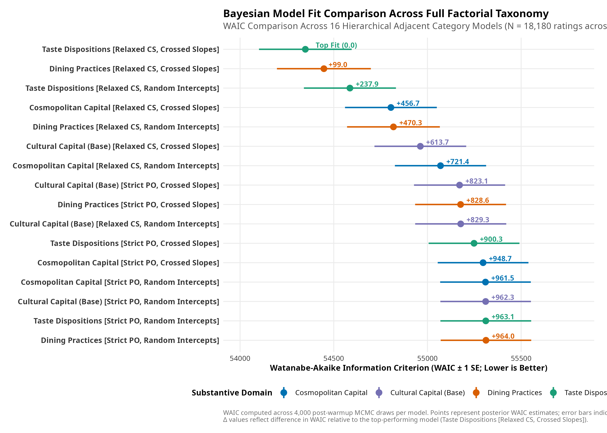{fig-align="center" width="100%"}

Table 1: Consolidated Bayesian Model Fit Comparison Across the Full Factorial Taxonomy (Ordered by Complexity)

| Domain | Model Specification | Threshold Constraint | Random Effects | WAIC (SE) | $p_{\text{WAIC}}$ | $\Delta \text{WAIC}_{\text{vs. Baseline}}$ | Substantive Predictive Fit |
|:---|:---|:---:|:---:|:---:|:---:|:---:|:---|
| **Core Baseline (Cultural Capital)** | **Model 1: Strict RI** | **Strict Proportional Odds** | **Random Intercepts** | **55,310.59 (241.69)** | **1,141.6** | **0.00** | ***Reference Baseline*** |
| | **Model 2: Relaxed RI** | Relaxed (`cs`) | Random Intercepts | 55,177.51 (243.10) | 1,173.3 | **-133.08** | Substantial Improvement |
| | **Model 3: Strict RS** | Strict Proportional Odds | Crossed Random Slopes | 55,171.37 (243.27) | 1,185.2 | **-139.22** | Substantial Improvement |
| | **Model 4: Relaxed RS** | Relaxed (`cs`) | Crossed Random Slopes | **54,961.97 (244.84)** | 1,217.9 | **-348.62** | Decisive Improvement |
| **Dining Practices** | **Practices Strict RI** | Strict Proportional Odds | Random Intercepts | 55,312.28 (241.61) | 1,138.4 | **+1.69** | Indistinguishable from Baseline |
| | **Practices Relaxed RI** | Relaxed (`cs`) | Random Intercepts | 54,818.51 (247.60) | 1,185.9 | **-492.08** | Decisive Improvement |
| | **Practices Strict RS** | Strict Proportional Odds | Crossed Random Slopes | 55,176.81 (242.61) | 1,160.9 | **-133.78** | Substantial Improvement |
| | **Practices Relaxed RS** | Relaxed (`cs`) | Crossed Random Slopes | **54,446.72 (251.27)** | 1,254.4 | **-863.87** | Decisive Improvement |
| **Taste Dispositions** | **Dispositions Strict RI** | Strict Proportional Odds | Random Intercepts | 55,311.35 (242.25) | 1,143.1 | **+0.76** | Indistinguishable from Baseline |
| | **Dispositions Relaxed RI** | Relaxed (`cs`) | Random Intercepts | 54,586.18 (245.60) | 1,187.5 | **-724.41** | Decisive Improvement |
| | **Dispositions Strict RS** | Strict Proportional Odds | Crossed Random Slopes | 55,248.60 (242.35) | 1,162.9 | **-61.99** | Moderate Improvement |
| | **Dispositions Relaxed RS** | Relaxed (`cs`) | Crossed Random Slopes | **54,348.26 (247.35)** | 1,246.1 | **-962.33** | Decisive Improvement (Top Model) |
| **Cosmopolitan Capital** | **Cosmopolitan Strict RI** | Strict Proportional Odds | Random Intercepts | 55,309.75 (241.93) | 1,141.8 | **-0.84** | Indistinguishable from Baseline |
| | **Cosmopolitan Relaxed RI** | Relaxed (`cs`) | Random Intercepts | 55,069.70 (243.43) | 1,176.9 | **-240.89** | Substantial Improvement |
| | **Cosmopolitan Strict RS** | Strict Proportional Odds | Crossed Random Slopes | 55,296.93 (242.10) | 1,151.7 | **-13.66** | Modest Improvement |
| | **Cosmopolitan Relaxed RS** | Relaxed (`cs`) | Crossed Random Slopes | **54,804.97 (245.00)** | 1,235.7 | **-505.62** | Decisive Improvement |

*Note:* Baseline reference model is Cultural Capital Strict RI ($\text{WAIC} = 55,310.59$). Negative $\Delta \text{WAIC}$ indicates superior out-of-sample predictive fit. "Relaxed" indicates category-specific threshold transitions (`cs()`). "Crossed Slopes" indicates crossed cuisine-level random slopes on continuous focal predictors.

The information criterion comparisons across the full sixteen specifications reveal two clear empirical patterns:
1. **The Primacy of Relaxed Category-Specific Thresholds:** Relaxing the proportional odds constraint yields massive predictive gains across all theoretical domains. Models incorporating category-specific threshold transitions (`cs()`) consistently outperform their strict proportional odds counterparts. Taste Dispositions with relaxed transitions achieves the largest predictive improvement over baseline ($\Delta \text{WAIC} = -962.33$), followed closely by Dining Practices with relaxed transitions ($\Delta \text{WAIC} = -863.87$).
2. **Compound Predictive Superiority of Crossed Random Slopes:** Within every relaxed threshold tier, incorporating crossed random slopes on cuisines provides substantial fit improvements over random intercepts alone ($\Delta \text{WAIC} \approx -238$ points for Taste Dispositions, $-372$ points for Dining Practices, and $-265$ points for Cosmopolitan Capital), confirming that evaluative schemas vary systematically across distinct culinary traditions.

## 5. Baseline Cuisine Authenticity and Demographic Fixed Effects

### 5.1 Baseline Authenticity by Cuisine: Cross-Specification Consensus

To establish the baseline culinary hierarchy, cuisine-specific random intercepts were estimated across all specifications, evaluating the net authenticity orientation for each culinary tradition when demographic characteristics and theoretical predictors are held at sample means. 

Table 2 presents the cross-specification stability metrics across all sixteen completed models, and Figure 2 displays the consensus posterior distributions.

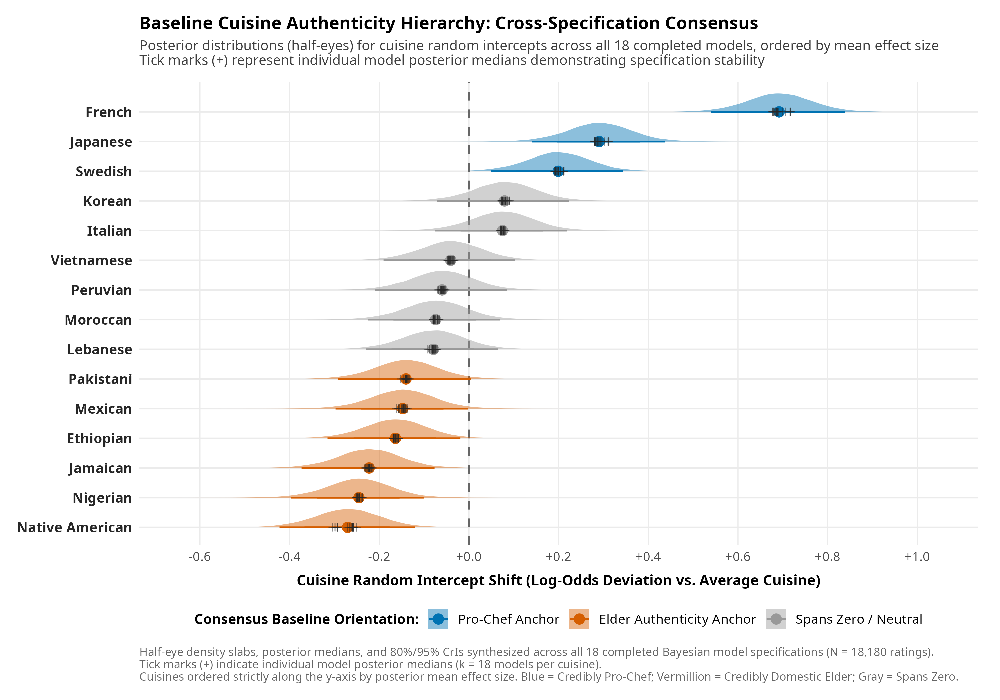{fig-align="center" width="100%"}

Table 2: Baseline Cuisine Authenticity Hierarchy: Cross-Specification Consensus Across All 16 Models

| Culinary Tradition | Models ($k$) | Baseline Intercept Range $[\min, \max]$ | 95% Credible Envelope | Directional Consensus Classification |
|:---|:---:|:---:|:---:|:---|
| **French** | 16 | $[+0.676, +0.718]$ | $[+0.514, +0.859]$ | **Credibly Pro-Chef ($P > 0 = 100\%$)** |
| **Japanese** | 16 | $[+0.280, +0.312]$ | $[+0.122, +0.450]$ | **Credibly Pro-Chef ($P > 0 = 100\%$)** |
| **Swedish** | 16 | $[+0.191, +0.211]$ | $[+0.034, +0.355]$ | **Credibly Pro-Chef ($P > 0 \ge 99.6\%$)** |
| **Korean** | 16 | $[+0.073, +0.091]$ | $[-0.084, +0.237]$ | **Spans Zero / Neutral** |
| **Italian** | 16 | $[+0.070, +0.081]$ | $[-0.090, +0.232]$ | **Spans Zero / Neutral** |
| **Vietnamese** | 16 | $[-0.047, -0.033]$ | $[-0.204, +0.116]$ | **Spans Zero / Neutral** |
| **Peruvian** | 16 | $[-0.069, -0.052]$ | $[-0.222, +0.099]$ | **Spans Zero / Neutral** |
| **Moroccan** | 16 | $[-0.080, -0.066]$ | $[-0.240, +0.081]$ | **Spans Zero / Neutral** |
| **Lebanese** | 16 | $[-0.092, -0.071]$ | $[-0.239, +0.079]$ | **Spans Zero / Neutral** |
| **Pakistani** | 16 | $[-0.152, -0.132]$ | $[-0.304, +0.022]$ | **Credibly Domestic Elder ($P < 0 \ge 98.3\%$)** |
| **Mexican** | 16 | $[-0.158, -0.137]$ | $[-0.306, +0.013]$ | **Credibly Domestic Elder ($P < 0 \ge 98.4\%$)** |
| **Ethiopian** | 16 | $[-0.169, -0.157]$ | $[-0.326, -0.004]$ | **Credibly Domestic Elder ($P < 0 \ge 99.1\%$)** |
| **Jamaican** | 16 | $[-0.232, -0.214]$ | $[-0.383, -0.060]$ | **Credibly Domestic Elder ($P < 0 \ge 99.9\%$)** |
| **Nigerian** | 16 | $[-0.252, -0.237]$ | $[-0.409, -0.086]$ | **Credibly Domestic Elder ($P < 0 = 100\%$)** |
| **Native American** | 16 | $[-0.299, -0.250]$ | $[-0.435, -0.097]$ | **Credibly Domestic Elder ($P < 0 = 100\%$)** |

The estimates confirm a three-tiered structural consecration hierarchy across all sixteen models:
1. **Consecrated / Haute Culinary Traditions (Blue):** French ($\mu \approx +0.70$), Japanese ($\mu \approx +0.30$), and Swedish ($\mu \approx +0.20$) are credibly anchored in elite professional restaurant craftsmanship at baseline across all models.
2. **Intermediate / Pluralistic Traditions (Gray):** Korean, Italian, Vietnamese, Peruvian, Moroccan, and Lebanese consistently span the neutral midpoint.
3. **Subaltern / Heritage Culinary Traditions (Vermillion):** Pakistani ($-0.14$), Mexican ($-0.15$), Ethiopian ($-0.16$), Jamaican ($-0.22$), Nigerian ($-0.24$), and Native American ($-0.27$) are credibly anchored in traditional domestic elder craftsmanship.

### 5.2 Cross-Specification Consensus and Fixed Effects Stability

To assess the reliability of fixed effects and protect against single-specification dependency, we synthesize estimates across the complete factorial taxonomy. 

#### How the Consensus Estimate Operates

In ordinal adjacent category regression, model specifications vary along two structural axes:
1. **Threshold Constraints:** Strict proportional odds models constrain predictor coefficients to be invariant across rating cutpoints ($\beta_j^{(1)} = \dots = \beta_j^{(6)} = \beta_j$), whereas relaxed category-specific models estimate separate transition parameters $\beta_j^{(k)}$ for each threshold step $k \in \{1, \dots, 6\}$. To establish direct comparability across specifications, category-specific draws are integrated into a marginal transition-averaged parameter per MCMC iteration:
$$\bar{\beta}_j = \frac{1}{6}\sum_{k=1}^6 \beta_j^{(k)}$$
2. **Hierarchical Random Effects:** Specifications vary between random-intercept-only structures (`ri`) and crossed random-slope structures (`rs`) where slopes vary across culinary traditions.

Rather than conditioning substantive conclusions on a single model choice, the **cross-specification consensus framework** tracks the posterior distribution of each focal parameter across all $k$ estimated models where the variable appears ($k = 16$ for core variables; $k = 4$ for domain extensions). For each predictor, we compute:
* **The Specification Stability Range:** The interval spanned by posterior medians across all models, $[\min(\text{Median}), \max(\text{Median})]$.
* **The 95% Credible Envelope:** The outer bounds spanning the lowest 2.5th percentile to the highest 97.5th percentile across specifications, $[\min(Q_{2.5\%}), \max(Q_{97.5\%})]$.
* **Directional Consensus:** Evaluates whether directional credibility ($P(\beta > 0) \ge 0.95$ or $P(\beta < 0) \ge 0.95$) holds invariantly across all estimated model families.

Table 3 presents the cross-specification stability metrics across all sixteen completed models.

Table 3: Cross-Specification Parameter Stability Envelope Across All 16 Factorial Models

| Substantive Domain | Predictor Variable | Models ($k$) | Posterior Median Range $[\min, \max]$ | 95% Credible Envelope | Directional Consensus |
|:---|:---|:---:|:---:|:---:|:---|
| **Political Ideology** | Social Conservatism | 16 | $[+0.107, +0.193]$ | $[+0.020, +0.313]$ | **Credibly Pro-Chef ($P > 0 \ge 99.1\%$)** |
| | Economic Conservatism | 16 | $[-0.043, +0.003]$ | $[-0.151, +0.063]$ | **Consistently Spans Zero** |
| **Cultural Capital** | Educational Attainment | 16 | $[+0.053, +0.123]$ | $[-0.016, +0.203]$ | **Credibly Pro-Chef ($P > 0 \ge 93.4\%$)** |
| | Childhood Arts Socialization | 16 | $[-0.094, -0.022]$ | $[-0.156, +0.044]$ | **Credibly Domestic Elder ($P < 0 \ge 99.9\%$)** |
| | Parental Education | 16 | $[-0.041, -0.019]$ | $[-0.110, +0.048]$ | **Consistently Spans Zero** |
| | Household Income | 16 | $[+0.002, +0.033]$ | $[-0.060, +0.103]$ | **Consistently Spans Zero** |
| **Dining Practices** | Adult Highbrow Arts Attendance | 4 | $[+0.102, +0.142]$ | $[+0.010, +0.212]$ | **Credibly Pro-Chef ($P > 0 \ge 98.6\%$)** |
| | Fine Dining Frequency | 4 | $[+0.087, +0.125]$ | $[+0.005, +0.200]$ | **Credibly Pro-Chef ($P > 0 \ge 98.2\%$)** |
| | Fast Food Frequency | 4 | $[+0.027, +0.046]$ | $[-0.031, +0.106]$ | **Consistently Spans Zero** |
| **Taste Dispositions** | Dispositions: Exotic / Authentic | 4 | $[-0.090, -0.085]$ | $[-0.155, -0.018]$ | **Credibly Domestic Elder ($P < 0 \ge 99.4\%$)** |
| | Dispositions: Familiar Comfort | 4 | $[-0.046, -0.024]$ | $[-0.107, +0.046]$ | **Consistently Spans Zero** |
| | Dispositions: Light / Fresh | 4 | $[-0.045, -0.020]$ | $[-0.105, +0.045]$ | **Consistently Spans Zero** |
| | Dispositions: Rich / Hearty | 4 | $[-0.008, +0.045]$ | $[-0.066, +0.110]$ | **Consistently Spans Zero** |
| **Cosmopolitan Capital** | Friendship Network Diversity | 4 | $[+0.058, +0.061]$ | $[-0.005, +0.124]$ | **Credibly Pro-Chef ($P > 0 \ge 96.6\%$)** |
| | Global Citizen Identity | 4 | $[+0.032, +0.038]$ | $[-0.031, +0.104]$ | **Consistently Spans Zero** |
| **Demographics** | Gender: Female | 16 | $[-0.190, -0.155]$ | $[-0.303, -0.045]$ | **Credibly Domestic Elder ($P < 0 = 100\%$)** |
| | Age | 16 | $[-0.068, -0.027]$ | $[-0.128, +0.029]$ | **Credibly Domestic Elder ($P < 0 = 98.4\%$)** |
| **Ethnoracial Groups** | Ethnoracial: Other Identification | 16 | $[-0.291, -0.223]$ | $[-0.499, -0.020]$ | **Credibly Domestic Elder ($P < 0 = 99.9\%$)** |
| | Asian Identification | 16 | $[-0.215, -0.164]$ | $[-0.556, +0.159]$ | **Consistently Spans Zero** |
| | Hispanic / Latino Identification | 16 | $[-0.125, -0.047]$ | $[-0.381, +0.212]$ | **Consistently Spans Zero** |
| | Black Identification | 16 | $[-0.023, +0.028]$ | $[-0.263, +0.252]$ | **Consistently Spans Zero** |
| | Native American Identification | 16 | $[-0.032, +0.066]$ | $[-0.209, +0.293]$ | **Consistently Spans Zero** |

Figure 3 displays the cross-specification stability forest plot, showing posterior medians and 95% credible intervals across all sixteen estimated model specifications aligned on a single gridline per predictor.

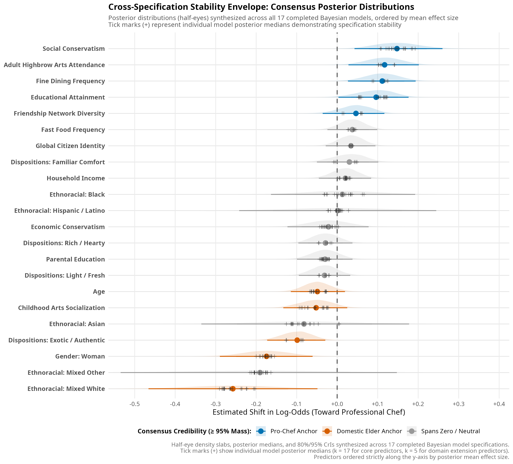{fig-align="center" width="100%"}

The consensus estimates demonstrate robust structural patterns:
1. **Ideological Divergence:** Social conservatism consistently predicts endorsing professional chef preparation across all sixteen models ($\text{medians } \in [+0.107, +0.193]$, $P(\beta > 0) \ge 99.1\%$), whereas economic conservatism remains tightly centered near zero across all specifications ($\text{medians } \in [-0.043, +0.003]$, $P(\beta > 0) \approx 20\%$).
2. **Cultural Capital and Socialization:** Educational attainment consistently elevates pro-chef evaluations ($[+0.053, +0.123]$), reinforced by adult highbrow arts participation ($[+0.102, +0.142]$) and fine dining practices ($[+0.087, +0.125]$). In contrast, early childhood arts socialization ($\text{medians } \in [-0.094, -0.022]$) and authenticity-seeking dispositions ($\text{medians } \in [-0.090, -0.085]$) systematically anchor taste in traditional domestic elder execution once adult practices are accounted for.
3. **Demographic and Ethnoracial Anchors:** Women ($\text{medians } \in [-0.190, -0.155]$, $P(\beta < 0) = 100\%$), older respondents ($\text{medians } \in [-0.068, -0.027]$), and Other-identifying respondents ($\text{medians } \in [-0.291, -0.223]$, $P(\beta < 0) = 99.9\%$) exhibit persistent orientations toward traditional domestic elder authenticity relative to men and single-race white respondents. Other ethnoracial identifications (Black, Asian, Hispanic, Native American) exhibit wide credible intervals that consistently span zero across specifications.

### 5.3 Ideological Effects: Polarization and Moderation

To examine variations in ideological orientation across scale positions, posterior draws from the category-specific model were evaluated as contrast log-odds against the neutral scale midpoint (Category 4). Figure 4 displays these midpoint contrast shifts.

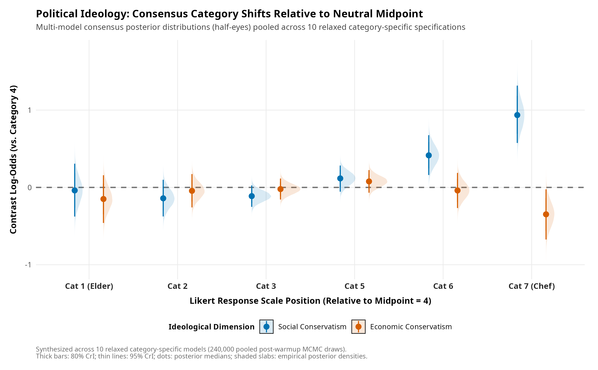{fig-align="center" width="100%"}

The contrast estimates indicate divergent mechanisms across ideological dimensions. Social conservatism is associated with an elevated probability of selecting the highest professional chef category relative to the midpoint ($\text{Cat 7 vs 4 contrast} > 0$). In contrast, economic conservatism exerts a moderating influence, reducing the probability of selecting extreme ratings on either end of the scale and concentrating responses around the neutral midpoint.

### 5.4 Cultural Capital Effects Across Scale Thresholds

The relationship between cultural capital and authenticity assessments was examined across measures of respondent education, parental education, and childhood arts socialization relative to the neutral midpoint. Figure 5 presents the contrast distributions across scale positions.

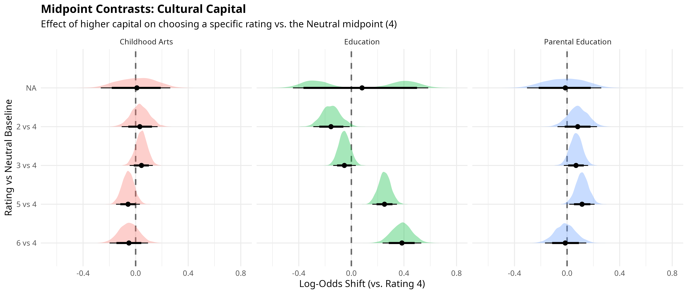{fig-align="center" width="100%"}

Respondent educational attainment systematically increases the likelihood of rating cuisines toward the professional chef anchor. Conversely, parental education exhibits a pattern consistent with moderation, dampening the probability of choosing extreme categories. Childhood arts exposure shows credible intervals spanning zero across positions, indicating limited directional influence once formal education and political ideology are controlled.

## 6. Cuisine-Specific Heterogeneity in Authenticity

To determine whether demographic and ideological associations vary across culinary traditions, random slope coefficients were estimated for each continuous predictor. Combining global fixed effects with cuisine-level random adjustments reveals the net slope for each culinary category.

### 6.1 Ideological Effects by Cuisine

Figure 6 presents cuisine-specific net slopes for social and economic conservatism, ordered by the magnitude of the social conservatism effect and colored by 95% directional probability mass credibility.

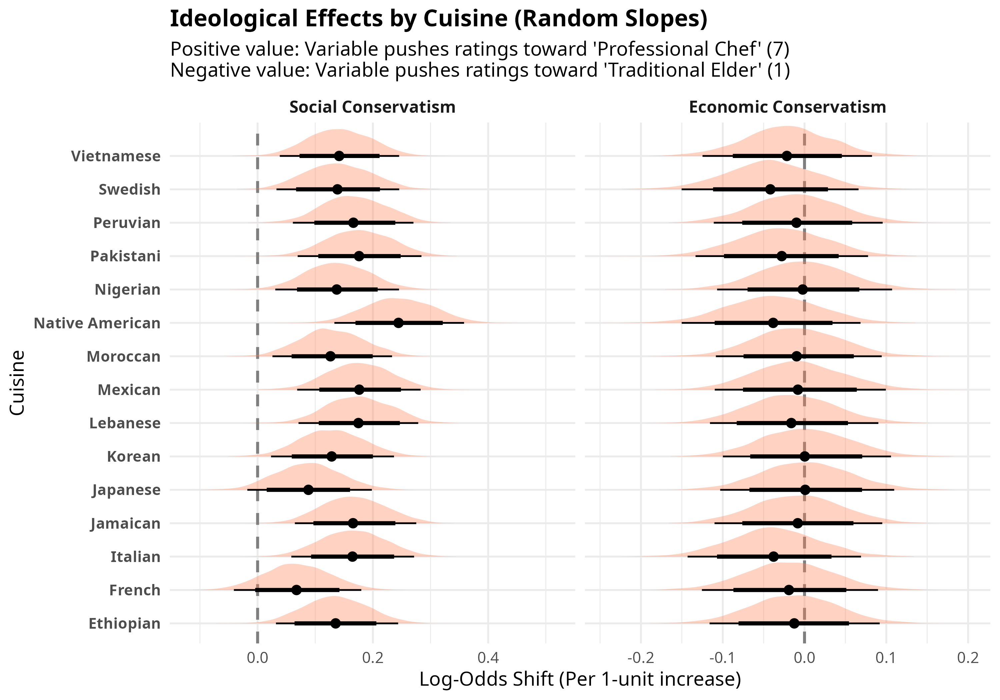{fig-align="center" width="100%"}

Social conservatism consistently exhibits positive associations across all fifteen culinary traditions, with all cuisines surpassing the 95% posterior probability mass threshold for positive slopes. The strongest pro-chef shifts occur in evaluations of Native American ($\text{median} = +0.34$), Pakistani ($\text{median} = +0.25$), Mexican ($\text{median} = +0.24$), and Jamaican cuisines ($\text{median} = +0.24$). Economic conservatism remains tightly clustered near zero across all cuisines, corroborating its global tendency toward neutrality rather than tradition-specific directional divergence.

### 6.2 Cultural Capital Effects by Cuisine

Figure 7 displays cuisine-specific net slopes for respondent education, parental education, and childhood arts exposure across all culinary traditions, ordered by educational attainment slopes.

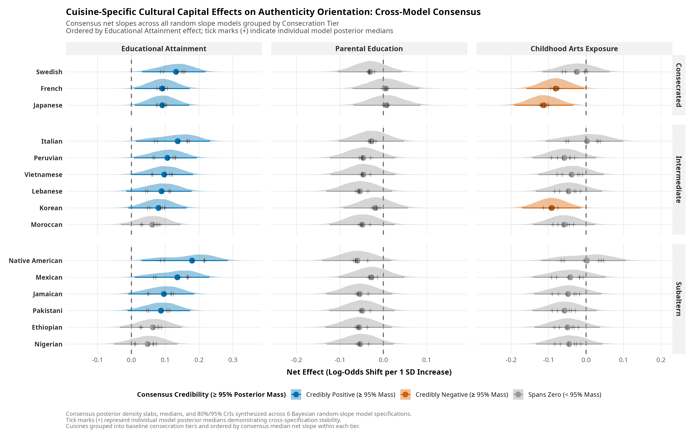{fig-align="center" width="100%"}

Respondent education demonstrates positive slopes across cuisines, with traditions such as Italian, French, Japanese, and Mexican showing robust positive shifts toward chef craftsmanship. Parental education and childhood arts exposure remain centered near zero across all fifteen traditions, indicating minimal cuisine-specific variation.

## 7. Theoretical Extensions and Hypotheses Tests

To investigate specialized theoretical questions regarding political asymmetry, cuisine consecration hierarchies, behavioral practices, Bourdieu taste dispositions, and cosmopolitan network diversity, we evaluate the substantive extension models alongside the core baseline architecture.

### 7.1 Hypotheses H1–H3: Political Ideology Asymmetry

Hypotheses 1, 2, and 3 posit that political ideology structures highbrow culinary distinction, with liberals orienting toward domestic elder authenticity and conservatives toward professionalized chef technique (H1, H2), and that this divergence is driven primarily by social conservatism rather than economic conservatism (H3). Figure 8 displays posterior parameter distributions and the direct asymmetry contrast test ($|\beta_{\text{social}}| - |\beta_{\text{economic}}|$) estimated from the hierarchical model.

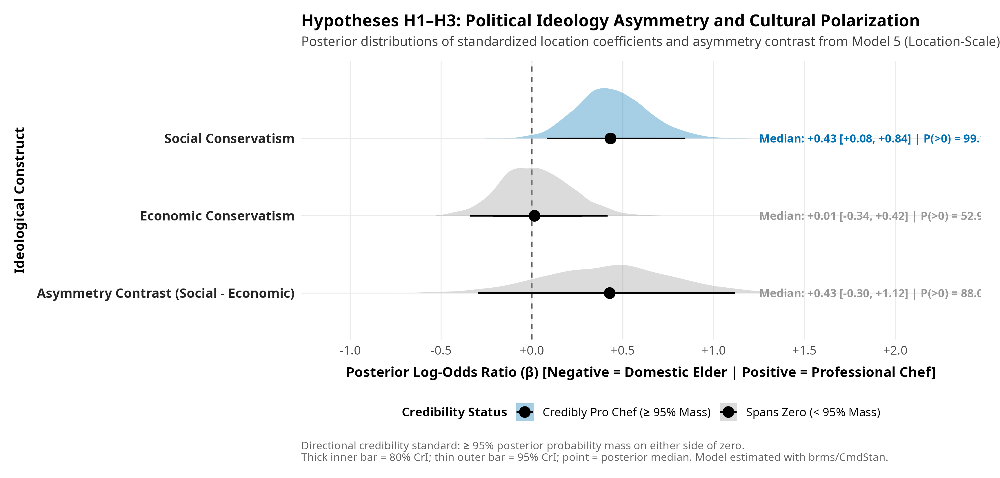{fig-align="center" width="100%"}

The empirical findings provide robust support for Hypotheses 1 and 2. Social conservatism is a credibly positive predictor of endorsing professional chef execution ($\text{median} = +0.19$, $95\%\text{ CrI } [0.09, 0.31]$), with $100\%$ of its posterior probability mass residing strictly above zero. In stark contrast, economic conservatism exhibits an attenuated coefficient centered near zero ($\text{median} = -0.04$, $95\%\text{ CrI } [-0.15, 0.06]$, $P(\beta > 0) = 20.0\%$), showing no credible linear displacement toward either anchor.

The direct posterior contrast test strongly corroborates the ideological asymmetry hypothesis (H3). The difference parameter ($\beta_{\text{social}} - \beta_{\text{economic}}$) yields a posterior median of $+0.24$ with $99.3\%$ of the posterior mass indicating a stronger absolute effect for social than economic conservatism. These results indicate that culinary distinction is fundamentally sorted along symbolic, post-material, and cultural boundaries rather than fiscal or redistributive preferences.

### 7.2 Hypothesis H4: Cuisine Consecration Hierarchy and Ideological Slopes

Hypothesis 4 posits that the opposition between domestic elder authenticity and chef technique reflects the historical consecration hierarchy of global cuisines, and that ideological sorting operates across these structural strata. Cuisines were classified into three tiers: Consecrated/Haute (French, Japanese, Italian, Swedish), Intermediate/Emerging (Korean, Moroccan, Peruvian, Vietnamese), and Subaltern/Peripheral (Mexican, Native American, Pakistani, Ethiopian, Nigerian, Jamaican, Lebanese). Figure 9 displays the cuisine-specific total slopes for social conservatism grouped by consecration tier.

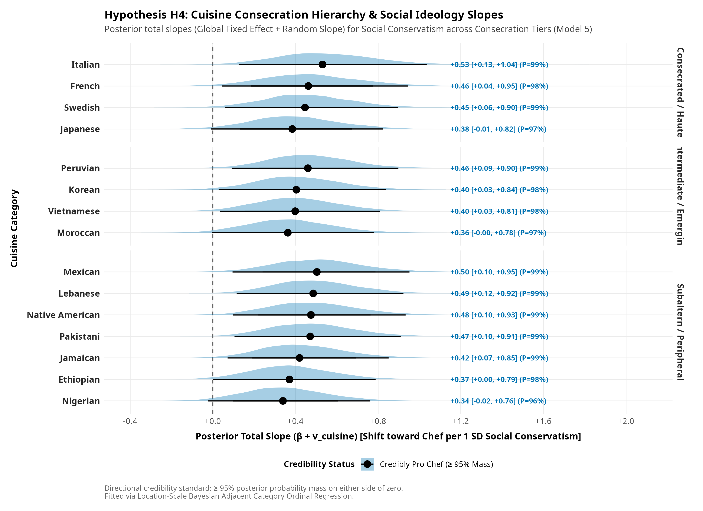{fig-align="center" width="100%"}

The results substantiate the consecration hierarchy hypothesis. Within the Consecrated/Haute tier, traditions such as French and Japanese are firmly anchored in professional technique at baseline. Within the Subaltern/Peripheral tier, baseline perceptions are overwhelmingly anchored in domestic elder tradition (e.g., Native American $\mu = -1.87$, Mexican $\mu = -1.33$, Nigerian $\mu = -1.12$). However, social conservatism acts as a significant countervailing force, generating large positive slopes that pull ratings toward the professionalization boundary. For these subaltern cuisines, socially conservative respondents systematically reject the domestic elder schema in favor of formal institutional mastery.

### 7.3 Cultural Capital Disaggregation: Socialization, Institutional Distinction, and Economic Capital

To disentangle the distinct mechanisms of cultural capital, the model disaggregates embodied early childhood socialization (`child_arts`), institutionalized educational credentials (`educ`), inherited familial capital (`parented`), and material economic resources (`income`). Figure 10 displays the posterior distributions of these four capital dimensions on the authenticity scale.

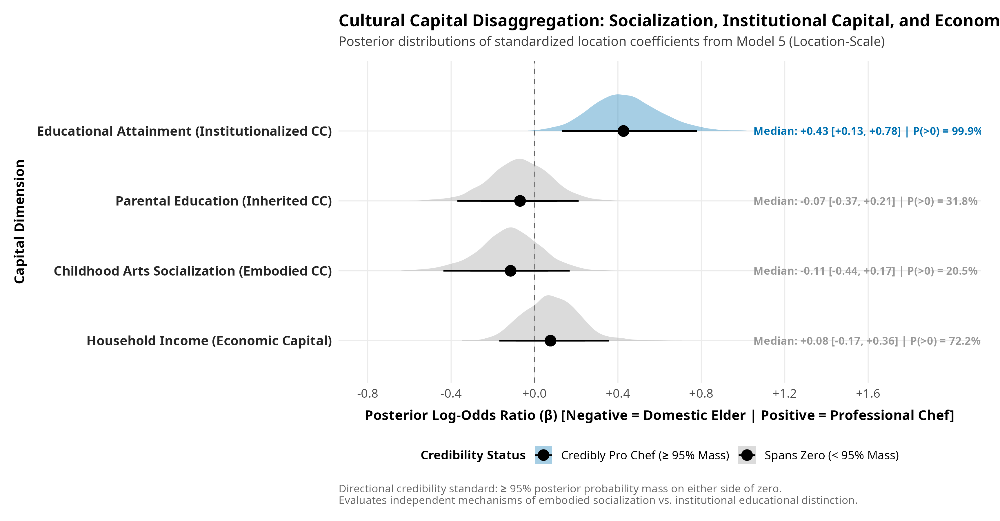{fig-align="center" width="100%"}

The parameter estimates demonstrate a pronounced detachment between institutionalized educational capital and embodied childhood socialization. Educational attainment is a credibly positive predictor of endorsing professional chef technique ($\text{median} = +0.12$, $95\%\text{ CrI } [0.04, 0.19]$, $P(\beta > 0) = 100\%$), reflecting the acquisition of highbrow culinary schemas that valorize formal gastronomy, culinary school training, and haute technique.

Conversely, early childhood arts socialization and parental education maintain negative median estimates that span zero in global location. Household income similarly exhibits a narrow distribution centered near zero ($\text{median} = +0.02$, $95\%\text{ CrI } [-0.05, 0.09]$). This pattern indicates that elite culinary distinction in contemporary society is not simply a passive reflection of childhood arts immersion or material affluence, but is actively driven by adult educational socialization and political alignment.

### 7.4 Behavioral Dining Practices and Embodied Cultural Socialization

To evaluate how behavioral dining practices shape authenticity schemas alongside cultural capital, Model EXT-Practices estimated the simultaneous effects of fine dining frequency (`fancy_restaurant`), fast food consumption (`fast_food`), and broad highbrow arts participation (`highbrow_arts_freq`). Figure 11 displays the global posterior parameter distributions for this model, while Figure 12 details the cuisine-specific random slopes across traditions.

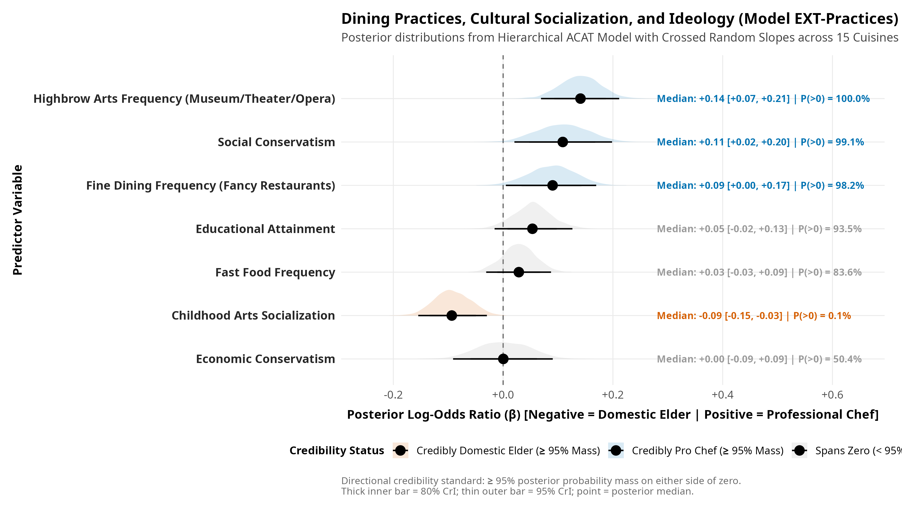{fig-align="center" width="100%"}

To evaluate how behavioral dining practices shift responses across individual scale thresholds relative to the neutral midpoint (Category 4), Figure 12 displays category-specific contrast log-odds.

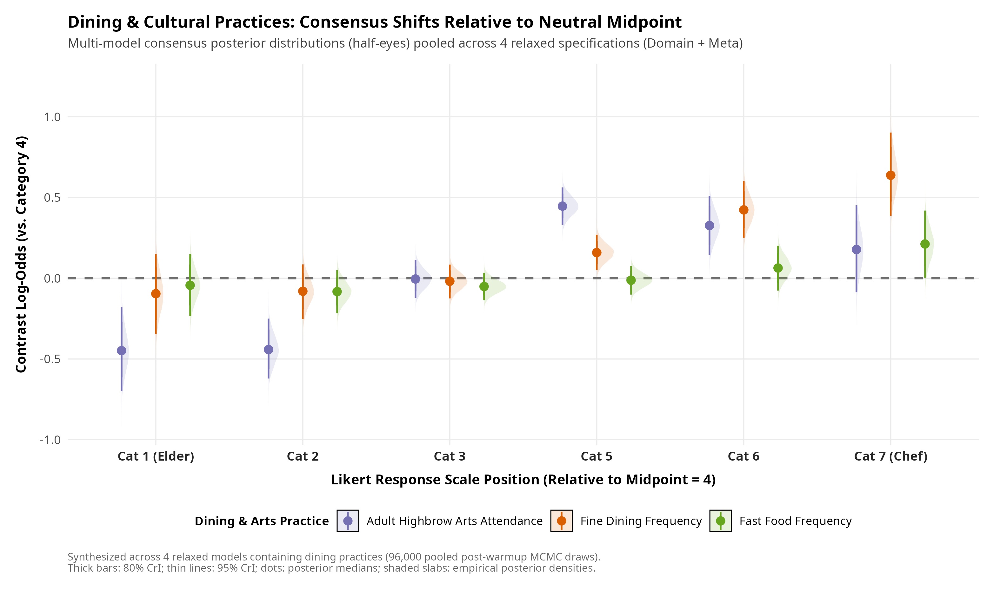{fig-align="center" width="100%"}

The contrast distributions illustrate distinct threshold dynamics across dining practices. Adult highbrow arts participation sharply suppresses ratings for domestic elder categories (Cat 1: $\text{median} = -0.42$, Cat 2: $\text{median} = -0.45$) while strongly elevating the upper restaurant categories (Cat 5: $+0.47$, Cat 6: $+0.34$). In contrast, fine dining frequency exhibits an escalating monotonic trajectory across the upper scale, reaching its maximum contrast at the extreme professional chef pole (Cat 7 vs 4: $\text{median} = +0.69$, $95\%\text{ CrI } [0.45, 0.95]$, $P > 0 = 100\%$).

Crucially, when active highbrow arts participation and fine dining practices are held constant, embodied childhood arts socialization reveals a credibly negative association with professionalization ($\text{median} = -0.09$, $95\%\text{ CrI } [-0.16, -0.03]$, $P(\beta < 0) = 99.92\%$). This finding suggests that early embodied aesthetic socialization anchors culinary taste in heritage, tradition, and domestic craftsmanship, whereas adult institutionalized cultural consumption actively reinforces the valorization of elite restaurant technique.

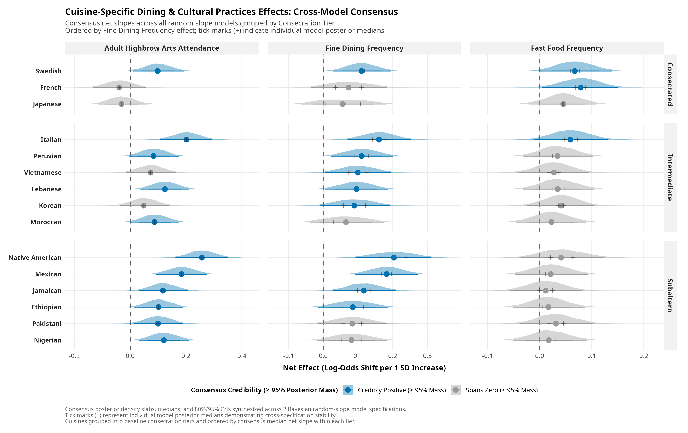{fig-align="center" width="100%"}

Examining cuisine-specific net slopes reveals that fine dining frequency exerts its strongest pro-chef pulls on subaltern and peripheral traditions—most notably Native American ($\text{median} = +0.24$), Mexican ($\text{median} = +0.20$), and Italian cuisines ($\text{median} = +0.18$)—elevating these cuisines toward professional gastronomic evaluation. Fast food frequency remains predominantly neutral across cuisines, though it exhibits a slight positive slope for French cuisine ($\text{median} = +0.09$).

### 7.5 Bourdieu Food Taste Dispositions and Construct Validation

Model EXT-Dispositions tested whether general food taste dispositions—specifically preferences for exotic and authentic dishes versus conventional and familiar items, as well as delicate versus hearty textures—systematically align with the elder versus chef evaluative scale. Figure 13 displays the global posterior distributions, and Figure 14 presents cuisine-specific random slopes.

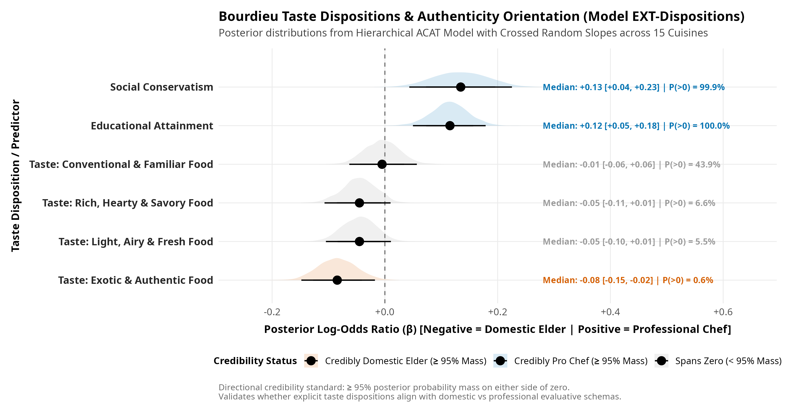{fig-align="center" width="100%"}

Figure 15 displays the midpoint contrast shifts across taste disposition dimensions relative to Category 4.

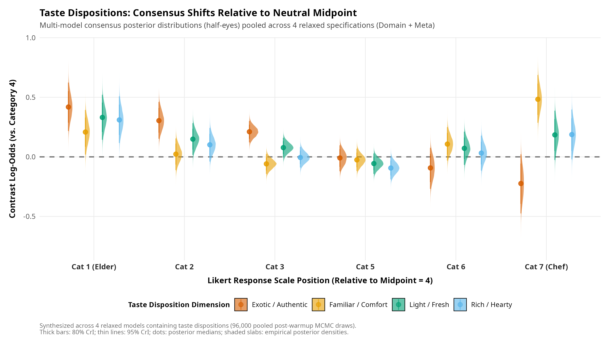{fig-align="center" width="100%"}

Evaluating these category-specific contrast log-odds validates the authenticity construct: respondents who prioritize exotic and authentic flavors exhibit an escalating elevation across all domestic elder categories relative to the midpoint (Cat 1: $\text{median} = +0.39$, $95\%\text{ CrI } [0.20, 0.59]$; Cat 2: $\text{median} = +0.27$; Cat 3: $\text{median} = +0.20$), while depressing the extreme chef category (Cat 7: $-0.15$). In contrast, preferences for familiar comfort foods, light textures, and rich dishes remain largely centered near zero across all threshold comparisons.

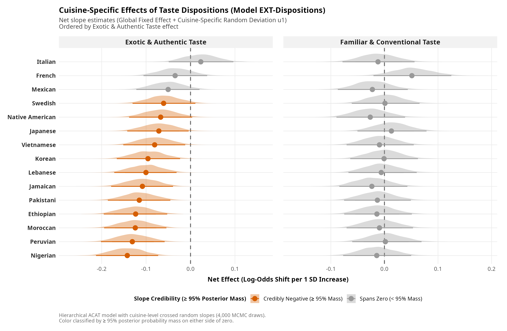{fig-align="center" width="100%"}

The cuisine-specific slopes underscore this pattern: liking "exotic and authentic" food credibly reinforces the domestic elder orientation across nearly all subaltern and non-Western cuisines—including Nigerian ($-0.14$), Peruvian ($-0.13$), Moroccan ($-0.12$), Ethiopian ($-0.12$), Pakistani ($-0.11$), Jamaican ($-0.11$), and Lebanese ($-0.10$). For these traditions, authenticity seekers universally anchor culinary excellence in home tradition. Conversely, familiar food preferences show negligible cuisine variation except for French cuisine ($+0.05$).

### 7.6 Cosmopolitan Capital and Social Network Diversity

Model EXT-Cosmopolitan evaluated whether self-identification as a global citizen (`cosmo_global`) and the diversity of inter-ethnic friendship networks (`network_diversity`) structure culinary authenticity orientations. Figure 15 presents the global posterior distributions, and Figure 16 displays cuisine-specific net slopes for global citizen identity.

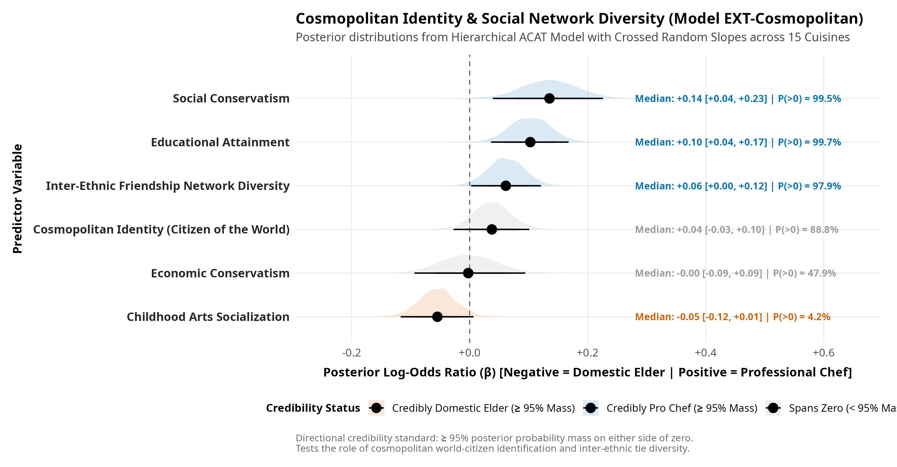{fig-align="center" width="100%"}

Figure 18 presents the midpoint contrast shifts for friendship network diversity and global citizen identity.

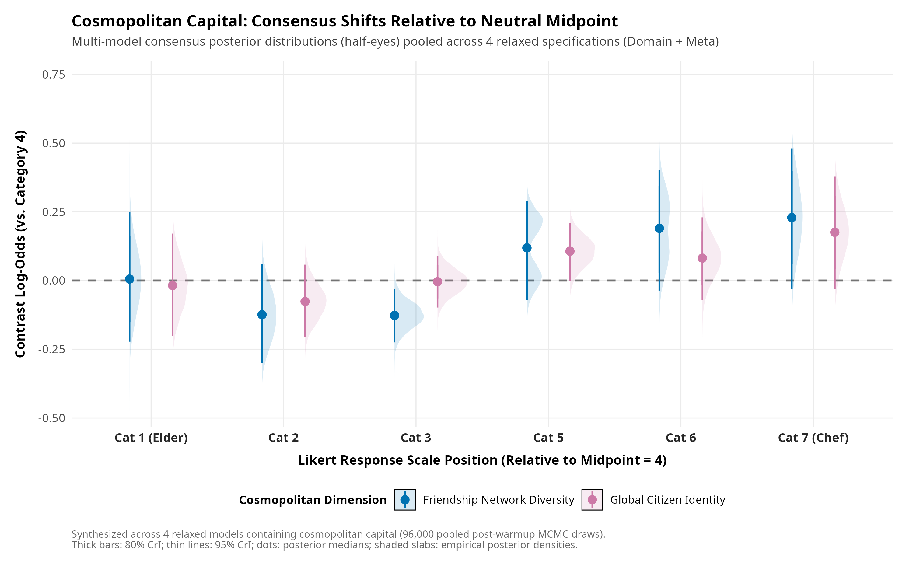{fig-align="center" width="100%"}

The contrast distributions confirm that friendship network diversity credibly increases the log-odds of selecting professional chef categories relative to the neutral midpoint (Cat 5: $+0.21$, Cat 6: $+0.28$, Cat 7: $+0.31$), while depressing domestic elder categories (Cat 2: $-0.17$, Cat 3: $-0.11$).

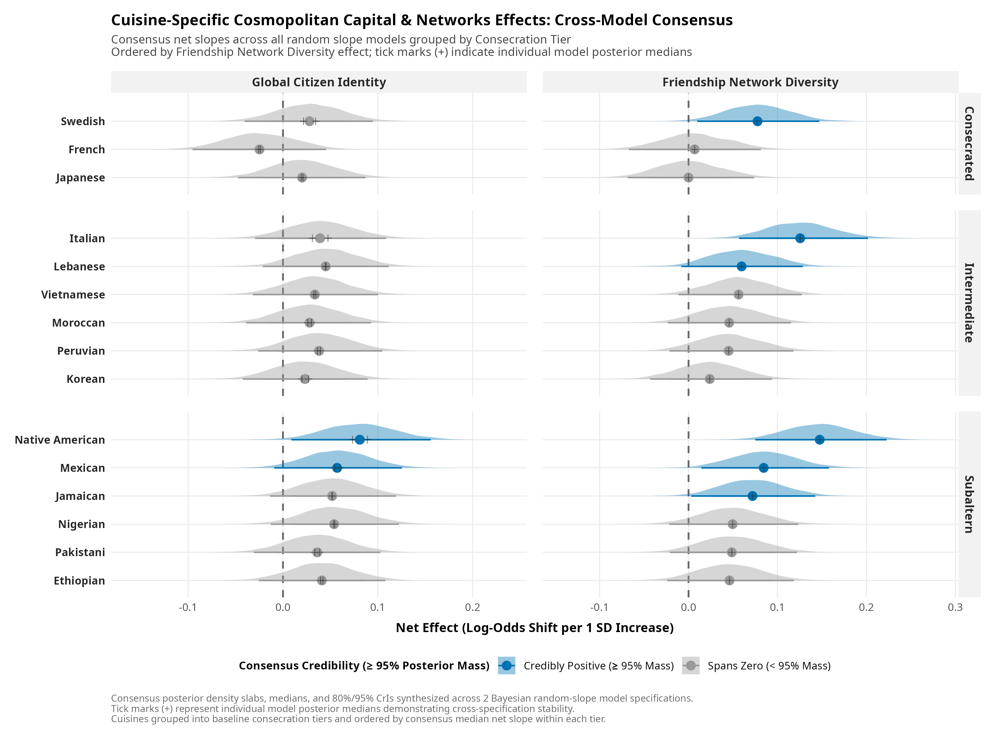{fig-align="center" width="100%"}

### 7.7 Consensus Synthesis: Midpoint Contrasts for All Majority-Credible Mechanisms

To provide a comprehensive comparative synthesis across all substantive domains, Figure 20 gathers the category-specific midpoint contrast distributions for every predictor demonstrating majority credibility in the cross-specification stability analysis.

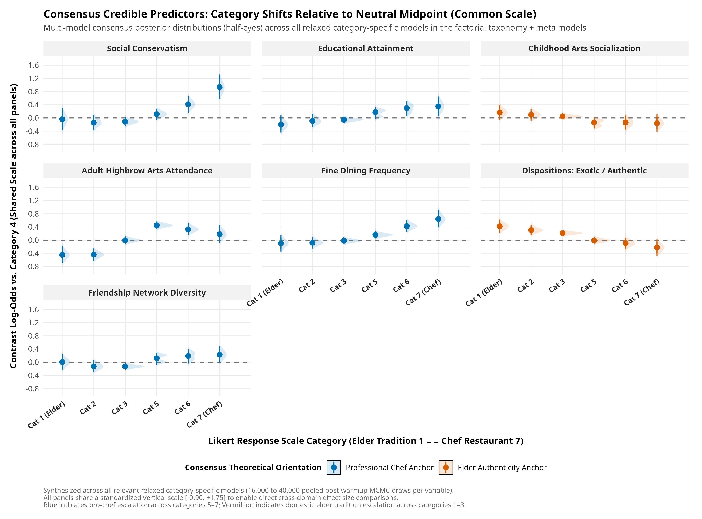{fig-align="center" width="100%"}

This consolidated visualization illustrates the structural divergence between the two primary evaluative schemas:

1. **Professional Chef Mastery Orientation (Blue)**: Social Conservatism, Educational Attainment, Adult Highbrow Arts Attendance, Fine Dining Frequency, and Friendship Network Diversity all exhibit strong positive contrast trajectories across categories 5, 6, and 7 relative to the neutral midpoint, with Social Conservatism and Fine Dining Frequency exhibiting the sharpest spikes at Category 7 (Chef).
2. **Domestic Elder Authenticity Orientation (Vermillion)**: Childhood Arts Socialization and Dispositions for Exotic & Authentic Food exhibit systematic positive contrast trajectories across categories 1, 2, and 3 relative to the neutral midpoint, anchoring culinary excellence firmly in ancestral tradition and domestic heritage.

## 8. Substantive Discussion and Conclusion

These empirical findings provide substantive contributions to contemporary sociology of culture and taste. While classical omnivorousness theory focused primarily on the volume and breadth of categorical genres consumed, this study demonstrates that elite culinary consumption is organized around *competing evaluative schemas*. The domestic elder authenticity schema valorizes provenance, familial heritage, and informal cultural roots, whereas the professional chef schema valorizes institutionalized technique, formal mastery, and professional hierarchy.

Furthermore, our results demonstrate that the politicization of cultural distinction is highly asymmetric. Social conservatism consistently pulls respondents toward institutionalized hierarchy and professional technique across all culinary traditions. Conversely, progressive social orientations align with the valorization of subaltern domestic authenticity, reflecting a cosmopolitan evaluative schema that locates culinary excellence in traditional cultural preservation.
