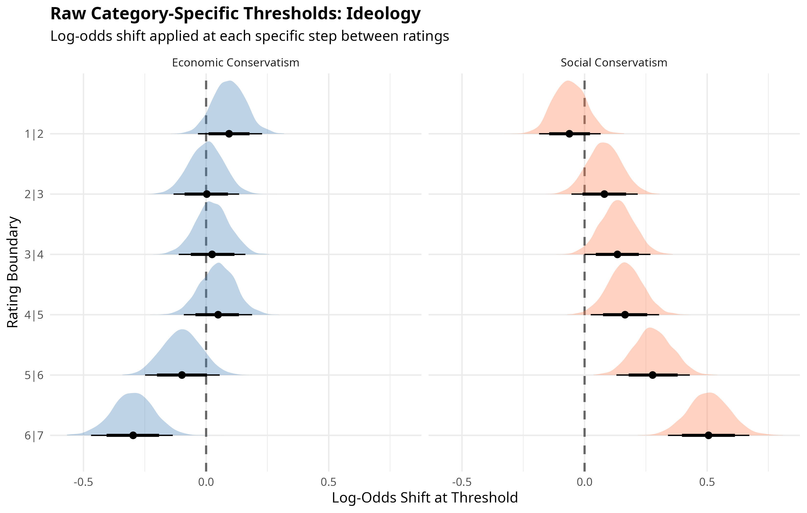
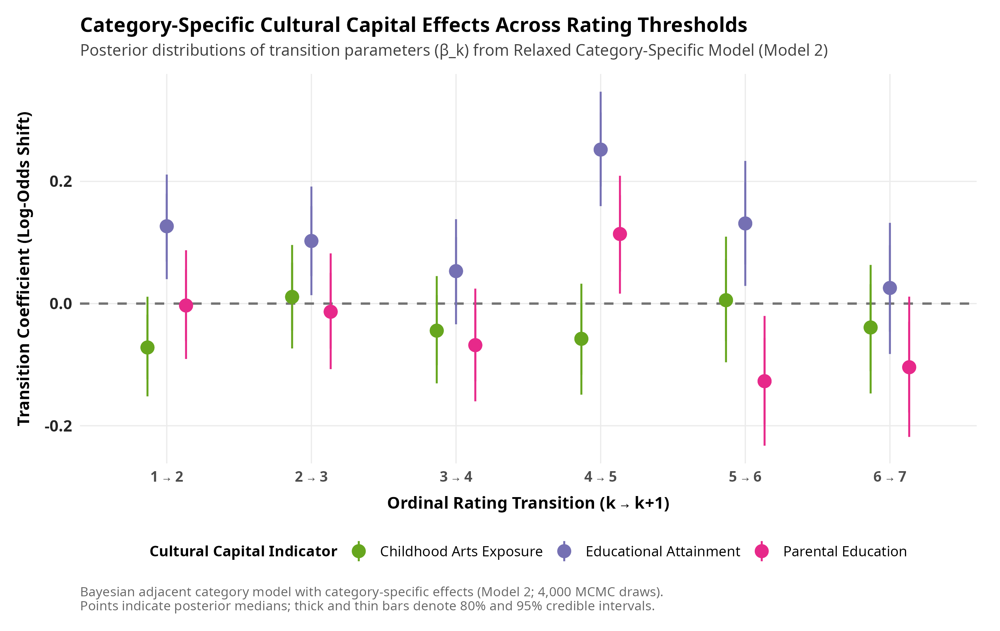
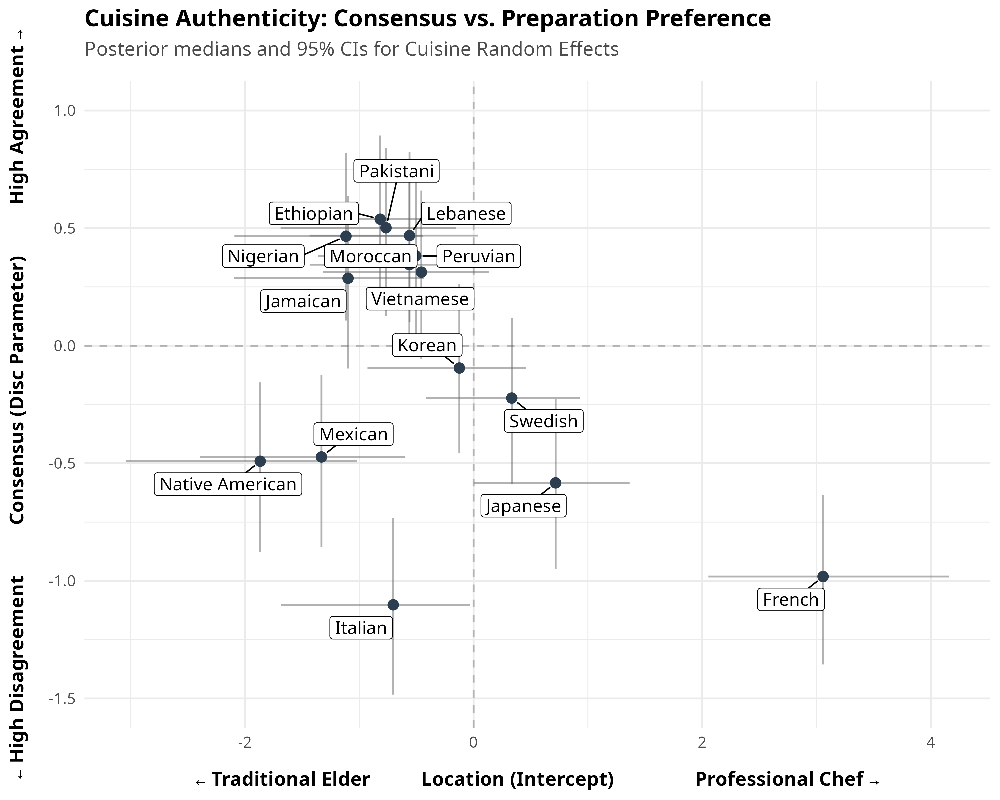
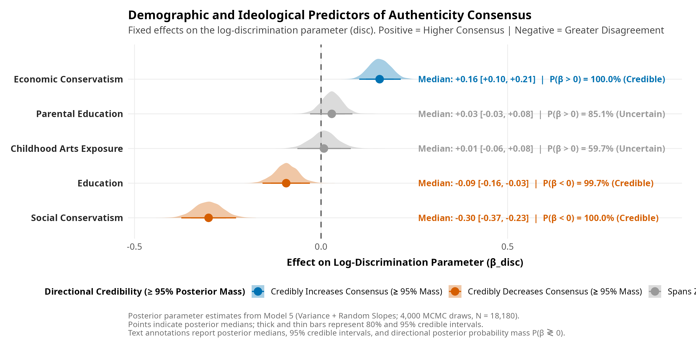
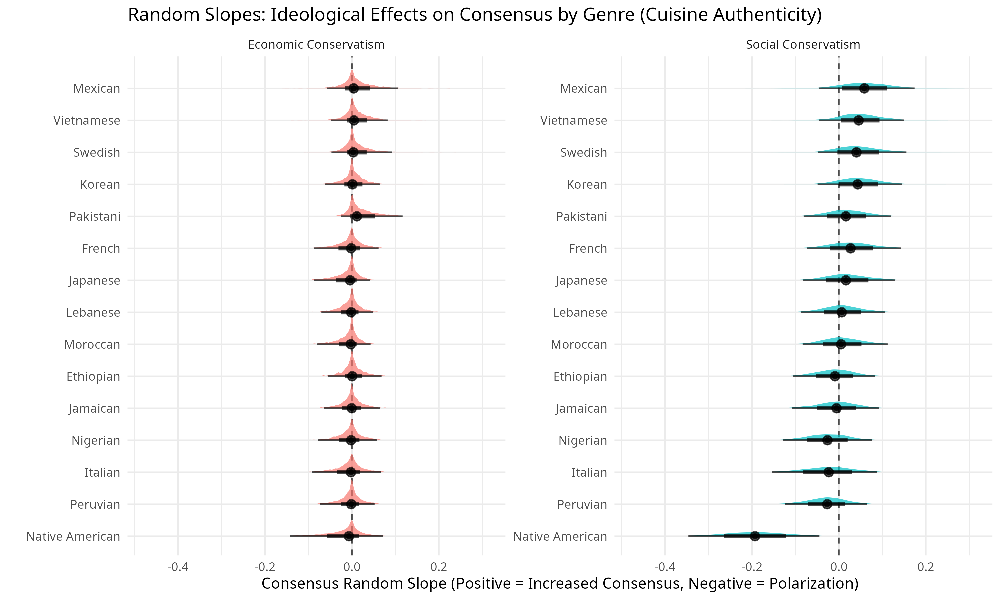
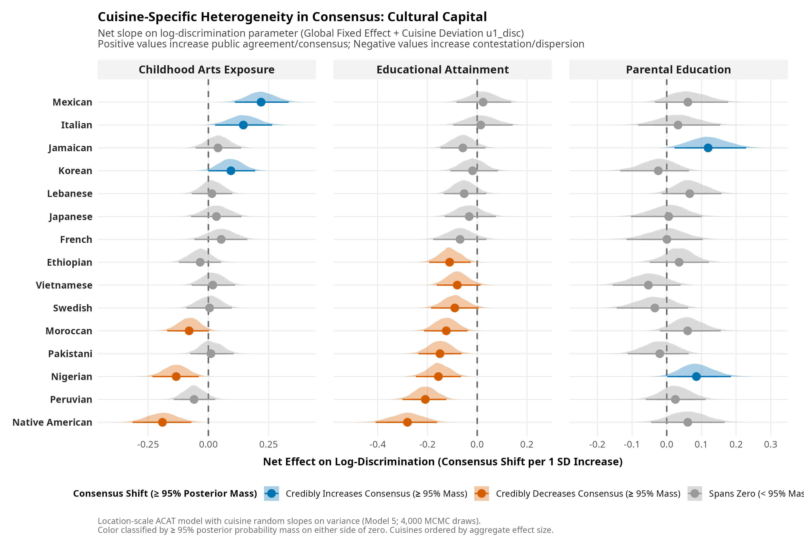

## 1. Introduction

This report details the data processing pipeline and empirical findings investigating how individuals evaluate culinary authenticity and professionalization across diverse cuisines. The primary dependent variable is measured on a seven-point ordinal scale assessing whether the ideal preparation of a given cuisine is grounded in domestic tradition or elite professional craftsmanship. Scale anchors range from 1, representing "a traditional recipe prepared by an elder at home," to 4, representing a neutral midpoint, up to 7, representing "a developed recipe prepared by a professional chef at a high-end restaurant." The substantive objective is to estimate how sociodemographic characteristics, cultural capital, and ideological orientations shape these authenticity ratings across fifteen distinct national and regional culinary traditions.

## 2. Data Preparation and Reshaping

The analytical dataset pools survey responses gathered across Qualtrics and Prolific samples. Data preprocessing, implemented in `data/recode.dat.R`, cleans and standardizes demographic indicators including respondent age, educational attainment, household income, gender, and ethnoracial identification. Key continuous predictors, such as social conservatism and economic conservatism indices, are mean-centered prior to estimation so that model intercepts reflect the predicted response for an average sample participant.

To accommodate crossed hierarchical modeling, the survey structure is converted from wide format into a stacked longitudinal panel. In this configuration, each observation corresponds to an individual respondent rating a specific cuisine. Structuring the data in this long format enables the simultaneous specification of random intercepts and slopes for both respondents and cuisines, accounting for individual-level response styles as well as baseline variations inherent to each culinary tradition.

## 3. Modeling Strategy: Bayesian Adjacent Category Models

Given the bounded, seven-point ordinal structure of the outcome variable, standard linear models are ill-suited because they impose equal spacing assumptions across discrete response categories. We therefore employ Bayesian multilevel ordinal regression via the `brms` package, specifying an adjacent category (ACAT) link function. Unlike cumulative models that estimate the probability of reaching or exceeding a given threshold, adjacent category models estimate the conditional log-odds of selecting category $k+1$ relative to category $k$. This formulation aligns directly with how survey respondents navigate step-wise alternatives along an ordered Likert scale.

To identify the most parsimonious and accurate representation of the data, six hierarchical model architectures were estimated and compared. The baseline strict model assumes invariant linear effects across all scale thresholds and culinary categories. The relaxed category-specific specification frees the proportional odds constraint by allowing predictor slopes to vary across each threshold transition via category-specific parameters. The random slopes specification incorporates cuisine-level random coefficients to capture tradition-specific demographic sensitivity. The relaxed random slopes model integrates both threshold variation and cuisine-level heterogeneity. Finally, distributional location-scale formulations introduce an explicit submodel predicting the discrimination parameter (`disc`), evaluating whether sociodemographic covariates systematically predict consensus or dispersion in authenticity assessments, both with and without cuisine-level random slopes.

Model estimation employs several computational optimizations implemented through the `cmdstanr` backend. Continuous predictors are standardized to unit variance to facilitate efficient Hamiltonian Monte Carlo exploration with the No-U-Turn Sampler (NUTS). Within-chain parallelization utilizes `reduce_sum` threading across central processing units. Posterior distributions are sampled across 2,000 iterations per chain, including 1,000 warmup iterations, yielding satisfactory effective sample sizes and diagnostic convergence without memory exhaustion.

## 4. Model Comparison

Model performance was evaluated using the Watanabe-Akaike Information Criterion (WAIC) computed across 1,000 posterior draws. Table 1 reports the resulting fit statistics, standard errors, and differences relative to the strict baseline model.

{fig-align="center" width="100%"}

| Rank | Model Description | WAIC | SE | $\Delta$ WAIC |
|:---|:---|:---:|:---:|:---:|
| 1 | Variance + Random Slopes | 53,432.63 | 249.41 | -1,877.96 |
| 2 | Variance Strict | 53,653.40 | 249.42 | -1,657.19 |
| 3 | Relaxed CS + Random Slopes | 54,961.97 | 244.84 | -348.62 |
| 4 | Random Slopes Strict | 55,171.37 | 243.27 | -139.22 |
| 5 | Relaxed CS | 55,177.51 | 243.10 | -133.08 |
| 6 | Baseline Strict | 55,310.59 | 241.69 | 0.00 |

The comparison indicates that incorporating a distributional variance component yields substantial improvements in predictive accuracy over location-only specifications, with $\Delta$ WAIC exceeding 1,600 points. Allowing for cuisine-specific random slopes and category-specific thresholds also provides measurable improvements over the strict baseline. The hybrid model integrating distributional variance with cuisine-specific random slopes demonstrates the strongest overall empirical fit.

## 5. Preliminary Findings: Baseline and Fixed Effects

### 5.1 Global Demographic Fixed Effects

Figure 1 displays the global fixed effects estimated from the top-performing location-scale specification, capturing the average influence of demographic and ideological predictors across culinary categories.

{fig-align="center" width="100%"}

The parameter estimates suggest that social conservatism and educational attainment are the primary positive predictors of associating authenticity with professional culinary preparation. Conversely, female respondents and individuals identifying as multiracial tend to lean toward the domestic elder anchor relative to male and white respondents, holding other covariates constant.

### 5.2 Baseline Authenticity by Cuisine

The hierarchical model estimates cuisine-specific random intercepts that reflect baseline perceptions of authenticity when holding demographic characteristics at their sample means.

{fig-align="center" width="100%"}

Culinary traditions exhibit substantial baseline differentiation. Native American, Nigerian, Jamaican, and Ethiopian cuisines display negative intercept estimates, indicating a prevailing tendency to associate these traditions with home-based elder preparation. In contrast, French, Japanese, and Swedish cuisines exhibit positive intercepts, aligning them more closely with formal restaurant professionalization.

### 5.3 Ideological Effects: Polarization and Moderation

To examine threshold-specific variations in ideological orientation, posterior draws from the category-specific model were evaluated as contrast probabilities against the neutral scale midpoint.

{fig-align="center" width="100%"}

The contrast estimates indicate divergent patterns across ideological dimensions. Social conservatism is associated with an elevated probability of selecting the highest professional chef category relative to the midpoint. In contrast, economic conservatism appears to exert a moderating influence, reducing the probability of selecting extreme ratings on either end of the scale and concentrating responses around the neutral midpoint.

{fig-align="center" width="100%"}

Examination of the raw threshold transitions confirms this mechanism. Social conservatism exhibits modest coefficients at lower scale boundaries but exerts a pronounced positive shift at the final threshold transition between categories 6 and 7. Economic conservatism displays negative coefficients across the upper thresholds, constraining respondents from advancing into the highest professionalization categories.

### 5.4 Cultural Capital Effects

The relationship between cultural capital and authenticity assessments was examined across measures of respondent education, parental education, and childhood arts socialization.

{fig-align="center" width="100%"}

Respondent educational attainment systematically increases the likelihood of rating cuisines toward the professional chef anchor. Conversely, parental education exhibits a pattern consistent with moderation, dampening the probability of choosing extreme categories. Childhood arts exposure shows credible intervals spanning zero across thresholds, indicating limited directional influence once formal education and political ideology are controlled.

{fig-align="center" width="100%"}

The threshold-specific estimates further illustrate these dynamics. Respondent education maintains consistent positive coefficients across successive thresholds, moving responses step-wise away from domestic tradition toward professionalization. In contrast, parental education displays negative coefficients at the upper threshold boundaries, dampening extreme endorsements of professionalization in favor of moderate scale positions.

## 6. Random Slopes: Demographic and Ideological Effects by Cuisine

To determine whether demographic and ideological associations vary across culinary traditions, random slope coefficients were estimated for each continuous predictor. Combining global fixed effects with cuisine-level random adjustments reveals the net effect for each culinary category.

### 6.1 Ideological Effects by Cuisine

{fig-align="center" width="100%"}

Social conservatism consistently exhibits positive associations across culinary traditions, with the strongest adjustments observed for French and Japanese cuisines. Economic conservatism remains tightly clustered around zero across all cuisines, corroborating its global tendency toward neutrality rather than tradition-specific directional divergence.

### 6.2 Cultural Capital Effects by Cuisine

{fig-align="center" width="100%"}

Respondent education demonstrates positive slopes across all cuisines, although the magnitude of this association is notably larger for French, Japanese, and Italian cuisines than for Nigerian or Jamaican cuisines. Parental education and childhood arts exposure remain centered near zero across all fifteen traditions, indicating minimal cuisine-specific variation.

## 7. Cultural Consensus and Dispersion

To assess public consensus and contestation surrounding authenticity definitions, a distributional location-scale ACAT model was estimated. This specification simultaneously models the location intercept alongside the discrimination parameter (`disc`), where higher discrimination values correspond to higher agreement (lower residual variance).

### 7.1 Baseline Consensus Across Cuisines

Figure 8 maps culinary traditions along two dimensions: baseline authenticity orientation on the horizontal axis and public consensus on the vertical axis.

{fig-align="center" width="100%"}

The resulting distribution identifies distinct culinary clusters. Traditions such as Ethiopian, Pakistani, and Lebanese exhibit high discrimination parameters alongside traditional orientation intercepts, indicating strong public consensus around home elder preparation. In contrast, Italian, French, and Japanese cuisines exhibit lower discrimination parameters, indicating greater dispersion in public perceptions regarding whether their authentic expression resides in domestic kitchens or haute cuisine establishments.

### 7.2 Demographic Predictors of Consensus

Figure 9 presents posterior parameter distributions for demographic effects on the global discrimination parameter.

{fig-align="center" width="100%"}

The posterior estimates indicate that higher educational attainment is associated with lower discrimination parameters, suggesting that educated respondents exhibit wider internal variance and less consensus in authenticity evaluations. Similarly, higher social conservatism is associated with decreased discrimination parameters relative to liberal respondents. Childhood arts exposure displays posterior distributions overlapping zero, showing no credible relationship with overall consensus.

## 8. Cuisine-Specific Heterogeneity in Consensus

Using the full distributional random slopes specification, we evaluated whether demographic impacts on rating dispersion vary across culinary traditions. Negative parameter values denote a decrease in consensus (higher variance), whereas positive values indicate heightened consensus.

### 8.1 Ideological Effects on Consensus

{fig-align="center" width="100%"}

The association between social conservatism and rating dispersion varies by cuisine. Social conservatism substantially reduces consensus for Mexican and Italian foods, whereas its effect is negligible for Nigerian and Ethiopian cuisines, where respondents across ideological categories remain similarly aligned.

### 8.2 Cultural Capital Effects on Consensus

{fig-align="center" width="100%"}

Educational attainment consistently reduces consensus across traditions, with the most pronounced dispersion observed in evaluations of Mexican, Italian, and Native American cuisines. In contrast, parental education and childhood arts exposure maintain narrow distributions centered near zero, indicating that inherited cultural capital plays a minimal role in structuring rating consensus across specific cuisines.
